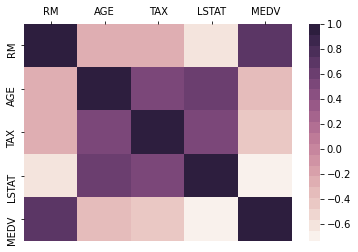
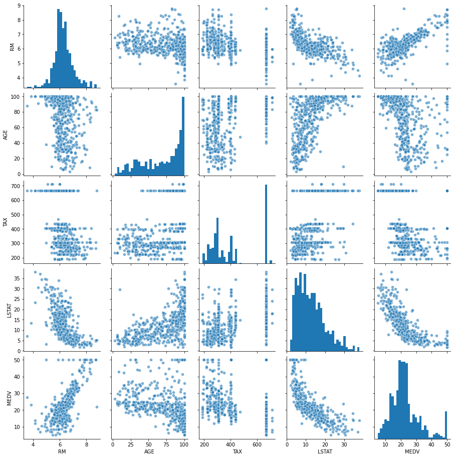
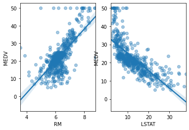
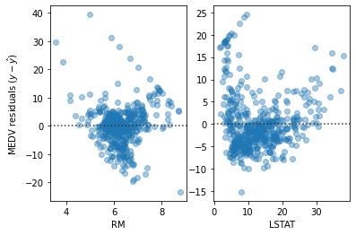
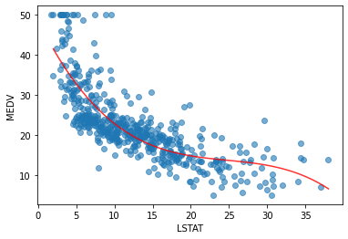
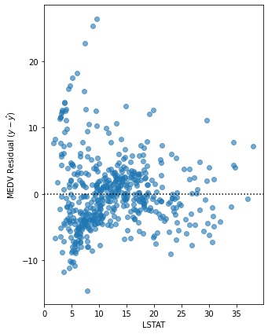

# Boston Housing Dataset analysis
This is the lesson from "Beginning Data Science with Python and Jupyter" by Alex Galea (Packt) - https://subscription.packtpub.com/book/big_data_and_business_intelligence/9781789532029


```python
# Load the dataset
from sklearn import datasets
boston = datasets.load_boston()
```


```python
# See the data structures type - hsould be a Bunch object
type(boston)
```


    sklearn.utils.Bunch


```python
# Find out more about bunch objects
from sklearn.utils import Bunch
Bunch?
```


```python
# Print the keys
boston.keys()
```


    dict_keys(['data', 'target', 'feature_names', 'DESCR', 'filename'])


```python
# Print the description
print(boston['DESCR'])
```

    .. _boston_dataset:
    
    Boston house prices dataset
    ---------------------------
    
    **Data Set Characteristics:**  
    
        :Number of Instances: 506 
    
        :Number of Attributes: 13 numeric/categorical predictive. Median Value (attribute 14) is usually the target.
    
        :Attribute Information (in order):
            - CRIM     per capita crime rate by town
            - ZN       proportion of residential land zoned for lots over 25,000 sq.ft.
            - INDUS    proportion of non-retail business acres per town
            - CHAS     Charles River dummy variable (= 1 if tract bounds river; 0 otherwise)
            - NOX      nitric oxides concentration (parts per 10 million)
            - RM       average number of rooms per dwelling
            - AGE      proportion of owner-occupied units built prior to 1940
            - DIS      weighted distances to five Boston employment centres
            - RAD      index of accessibility to radial highways
            - TAX      full-value property-tax rate per $10,000
            - PTRATIO  pupil-teacher ratio by town
            - B        1000(Bk - 0.63)^2 where Bk is the proportion of blacks by town
            - LSTAT    % lower status of the population
            - MEDV     Median value of owner-occupied homes in $1000's
    
        :Missing Attribute Values: None
    
        :Creator: Harrison, D. and Rubinfeld, D.L.
    
    This is a copy of UCI ML housing dataset.
    https://archive.ics.uci.edu/ml/machine-learning-databases/housing/
    
    
    This dataset was taken from the StatLib library which is maintained at Carnegie Mellon University.
    
    The Boston house-price data of Harrison, D. and Rubinfeld, D.L. 'Hedonic
    prices and the demand for clean air', J. Environ. Economics & Management,
    vol.5, 81-102, 1978.   Used in Belsley, Kuh & Welsch, 'Regression diagnostics
    ...', Wiley, 1980.   N.B. Various transformations are used in the table on
    pages 244-261 of the latter.
    
    The Boston house-price data has been used in many machine learning papers that address regression
    problems.   
         
    .. topic:: References
    
       - Belsley, Kuh & Welsch, 'Regression diagnostics: Identifying Influential Data and Sources of Collinearity', Wiley, 1980. 244-261.
       - Quinlan,R. (1993). Combining Instance-Based and Model-Based Learning. In Proceedings on the Tenth International Conference of Machine Learning, 236-243, University of Massachusetts, Amherst. Morgan Kaufmann.
    
    


```python
# Create a Pandas DataFrame to hold the data
# First show its init signature
import pandas as pd
pd.DataFrame?
```


```python
# Look at the data, shape and feature names
boston['data']
```


    array([[6.3200e-03, 1.8000e+01, 2.3100e+00, ..., 1.5300e+01, 3.9690e+02,
            4.9800e+00],
           [2.7310e-02, 0.0000e+00, 7.0700e+00, ..., 1.7800e+01, 3.9690e+02,
            9.1400e+00],
           [2.7290e-02, 0.0000e+00, 7.0700e+00, ..., 1.7800e+01, 3.9283e+02,
            4.0300e+00],
           ...,
           [6.0760e-02, 0.0000e+00, 1.1930e+01, ..., 2.1000e+01, 3.9690e+02,
            5.6400e+00],
           [1.0959e-01, 0.0000e+00, 1.1930e+01, ..., 2.1000e+01, 3.9345e+02,
            6.4800e+00],
           [4.7410e-02, 0.0000e+00, 1.1930e+01, ..., 2.1000e+01, 3.9690e+02,
            7.8800e+00]])


```python
boston['data'].shape
```


    (506, 13)


```python
boston['feature_names']
```


    array(['CRIM', 'ZN', 'INDUS', 'CHAS', 'NOX', 'RM', 'AGE', 'DIS', 'RAD',
           'TAX', 'PTRATIO', 'B', 'LSTAT'], dtype='<U7')


```python
# We know we have a 2D numpy array with 13 features and 506 samples. Let's load it into df
df = pd.DataFrame(data=boston['data'], columns=boston['feature_names'])
```


```python
# The "target" is what we are trying to predict
# For this exercise, median house prices in $1000s (MEDV). 
# Let's look at the target's shape
boston['target'].shape
```


    (506,)


```python
# Add the target variable to df
df['MEDV'] = boston['target']
```


```python
# We want the target at the front of our DataFrame to help us distinguish it from other features
# We introduce a dummy variable, remove the column and then concatenate it along the first axis
# axis = 0 to combine rows, axis = 1 (what we're doing here) for columns
y = df['MEDV'].copy()
del df['MEDV']
df = pd.concat((y, df), axis=1)
```


```python
# Have a look at the head, tail and length of the data for sanity checking
df.head()
```


<div>
<style scoped>
    .dataframe tbody tr th:only-of-type {
        vertical-align: middle;
    }

    .dataframe tbody tr th {
        vertical-align: top;
    }

    .dataframe thead th {
        text-align: right;
    }
</style>
<table border="1" class="dataframe">
  <thead>
    <tr style="text-align: right;">
      <th></th>
      <th>MEDV</th>
      <th>CRIM</th>
      <th>ZN</th>
      <th>INDUS</th>
      <th>CHAS</th>
      <th>NOX</th>
      <th>RM</th>
      <th>AGE</th>
      <th>DIS</th>
      <th>RAD</th>
      <th>TAX</th>
      <th>PTRATIO</th>
      <th>B</th>
      <th>LSTAT</th>
    </tr>
  </thead>
  <tbody>
    <tr>
      <th>0</th>
      <td>24.0</td>
      <td>0.00632</td>
      <td>18.0</td>
      <td>2.31</td>
      <td>0.0</td>
      <td>0.538</td>
      <td>6.575</td>
      <td>65.2</td>
      <td>4.0900</td>
      <td>1.0</td>
      <td>296.0</td>
      <td>15.3</td>
      <td>396.90</td>
      <td>4.98</td>
    </tr>
    <tr>
      <th>1</th>
      <td>21.6</td>
      <td>0.02731</td>
      <td>0.0</td>
      <td>7.07</td>
      <td>0.0</td>
      <td>0.469</td>
      <td>6.421</td>
      <td>78.9</td>
      <td>4.9671</td>
      <td>2.0</td>
      <td>242.0</td>
      <td>17.8</td>
      <td>396.90</td>
      <td>9.14</td>
    </tr>
    <tr>
      <th>2</th>
      <td>34.7</td>
      <td>0.02729</td>
      <td>0.0</td>
      <td>7.07</td>
      <td>0.0</td>
      <td>0.469</td>
      <td>7.185</td>
      <td>61.1</td>
      <td>4.9671</td>
      <td>2.0</td>
      <td>242.0</td>
      <td>17.8</td>
      <td>392.83</td>
      <td>4.03</td>
    </tr>
    <tr>
      <th>3</th>
      <td>33.4</td>
      <td>0.03237</td>
      <td>0.0</td>
      <td>2.18</td>
      <td>0.0</td>
      <td>0.458</td>
      <td>6.998</td>
      <td>45.8</td>
      <td>6.0622</td>
      <td>3.0</td>
      <td>222.0</td>
      <td>18.7</td>
      <td>394.63</td>
      <td>2.94</td>
    </tr>
    <tr>
      <th>4</th>
      <td>36.2</td>
      <td>0.06905</td>
      <td>0.0</td>
      <td>2.18</td>
      <td>0.0</td>
      <td>0.458</td>
      <td>7.147</td>
      <td>54.2</td>
      <td>6.0622</td>
      <td>3.0</td>
      <td>222.0</td>
      <td>18.7</td>
      <td>396.90</td>
      <td>5.33</td>
    </tr>
  </tbody>
</table>
</div>


```python
df.tail()
```


<div>
<style scoped>
    .dataframe tbody tr th:only-of-type {
        vertical-align: middle;
    }

    .dataframe tbody tr th {
        vertical-align: top;
    }

    .dataframe thead th {
        text-align: right;
    }
</style>
<table border="1" class="dataframe">
  <thead>
    <tr style="text-align: right;">
      <th></th>
      <th>MEDV</th>
      <th>CRIM</th>
      <th>ZN</th>
      <th>INDUS</th>
      <th>CHAS</th>
      <th>NOX</th>
      <th>RM</th>
      <th>AGE</th>
      <th>DIS</th>
      <th>RAD</th>
      <th>TAX</th>
      <th>PTRATIO</th>
      <th>B</th>
      <th>LSTAT</th>
    </tr>
  </thead>
  <tbody>
    <tr>
      <th>501</th>
      <td>22.4</td>
      <td>0.06263</td>
      <td>0.0</td>
      <td>11.93</td>
      <td>0.0</td>
      <td>0.573</td>
      <td>6.593</td>
      <td>69.1</td>
      <td>2.4786</td>
      <td>1.0</td>
      <td>273.0</td>
      <td>21.0</td>
      <td>391.99</td>
      <td>9.67</td>
    </tr>
    <tr>
      <th>502</th>
      <td>20.6</td>
      <td>0.04527</td>
      <td>0.0</td>
      <td>11.93</td>
      <td>0.0</td>
      <td>0.573</td>
      <td>6.120</td>
      <td>76.7</td>
      <td>2.2875</td>
      <td>1.0</td>
      <td>273.0</td>
      <td>21.0</td>
      <td>396.90</td>
      <td>9.08</td>
    </tr>
    <tr>
      <th>503</th>
      <td>23.9</td>
      <td>0.06076</td>
      <td>0.0</td>
      <td>11.93</td>
      <td>0.0</td>
      <td>0.573</td>
      <td>6.976</td>
      <td>91.0</td>
      <td>2.1675</td>
      <td>1.0</td>
      <td>273.0</td>
      <td>21.0</td>
      <td>396.90</td>
      <td>5.64</td>
    </tr>
    <tr>
      <th>504</th>
      <td>22.0</td>
      <td>0.10959</td>
      <td>0.0</td>
      <td>11.93</td>
      <td>0.0</td>
      <td>0.573</td>
      <td>6.794</td>
      <td>89.3</td>
      <td>2.3889</td>
      <td>1.0</td>
      <td>273.0</td>
      <td>21.0</td>
      <td>393.45</td>
      <td>6.48</td>
    </tr>
    <tr>
      <th>505</th>
      <td>11.9</td>
      <td>0.04741</td>
      <td>0.0</td>
      <td>11.93</td>
      <td>0.0</td>
      <td>0.573</td>
      <td>6.030</td>
      <td>80.8</td>
      <td>2.5050</td>
      <td>1.0</td>
      <td>273.0</td>
      <td>21.0</td>
      <td>396.90</td>
      <td>7.88</td>
    </tr>
  </tbody>
</table>
</div>


```python
len(df)
```


    506


```python
# See the data types for each column
# If variables are all floats and continuous variables (including the target), probs a regression problem
df.dtypes
```


    MEDV       float64
    CRIM       float64
    ZN         float64
    INDUS      float64
    CHAS       float64
    NOX        float64
    RM         float64
    AGE        float64
    DIS        float64
    RAD        float64
    TAX        float64
    PTRATIO    float64
    B          float64
    LSTAT      float64
    dtype: object


```python
# Clean up any NaN values - we identify them first
df.isnull().sum()
```


    MEDV       0
    CRIM       0
    ZN         0
    INDUS      0
    CHAS       0
    NOX        0
    RM         0
    AGE        0
    DIS        0
    RAD        0
    TAX        0
    PTRATIO    0
    B          0
    LSTAT      0
    dtype: int64


```python
# No NaNs to clean, but we want to remove some columns we won't be using for this particular exercise
for col in ['ZN', 'NOX', 'RAD', 'PTRATIO', 'B']:
    del df[col]
```


```python
# Describe quantitative data features
# The .T at the end swaps rows and columns
df.describe().T
```


<div>
<style scoped>
    .dataframe tbody tr th:only-of-type {
        vertical-align: middle;
    }

    .dataframe tbody tr th {
        vertical-align: top;
    }

    .dataframe thead th {
        text-align: right;
    }
</style>
<table border="1" class="dataframe">
  <thead>
    <tr style="text-align: right;">
      <th></th>
      <th>count</th>
      <th>mean</th>
      <th>std</th>
      <th>min</th>
      <th>25%</th>
      <th>50%</th>
      <th>75%</th>
      <th>max</th>
    </tr>
  </thead>
  <tbody>
    <tr>
      <th>MEDV</th>
      <td>506.0</td>
      <td>22.532806</td>
      <td>9.197104</td>
      <td>5.00000</td>
      <td>17.025000</td>
      <td>21.20000</td>
      <td>25.000000</td>
      <td>50.0000</td>
    </tr>
    <tr>
      <th>CRIM</th>
      <td>506.0</td>
      <td>3.613524</td>
      <td>8.601545</td>
      <td>0.00632</td>
      <td>0.082045</td>
      <td>0.25651</td>
      <td>3.677083</td>
      <td>88.9762</td>
    </tr>
    <tr>
      <th>INDUS</th>
      <td>506.0</td>
      <td>11.136779</td>
      <td>6.860353</td>
      <td>0.46000</td>
      <td>5.190000</td>
      <td>9.69000</td>
      <td>18.100000</td>
      <td>27.7400</td>
    </tr>
    <tr>
      <th>CHAS</th>
      <td>506.0</td>
      <td>0.069170</td>
      <td>0.253994</td>
      <td>0.00000</td>
      <td>0.000000</td>
      <td>0.00000</td>
      <td>0.000000</td>
      <td>1.0000</td>
    </tr>
    <tr>
      <th>RM</th>
      <td>506.0</td>
      <td>6.284634</td>
      <td>0.702617</td>
      <td>3.56100</td>
      <td>5.885500</td>
      <td>6.20850</td>
      <td>6.623500</td>
      <td>8.7800</td>
    </tr>
    <tr>
      <th>AGE</th>
      <td>506.0</td>
      <td>68.574901</td>
      <td>28.148861</td>
      <td>2.90000</td>
      <td>45.025000</td>
      <td>77.50000</td>
      <td>94.075000</td>
      <td>100.0000</td>
    </tr>
    <tr>
      <th>DIS</th>
      <td>506.0</td>
      <td>3.795043</td>
      <td>2.105710</td>
      <td>1.12960</td>
      <td>2.100175</td>
      <td>3.20745</td>
      <td>5.188425</td>
      <td>12.1265</td>
    </tr>
    <tr>
      <th>TAX</th>
      <td>506.0</td>
      <td>408.237154</td>
      <td>168.537116</td>
      <td>187.00000</td>
      <td>279.000000</td>
      <td>330.00000</td>
      <td>666.000000</td>
      <td>711.0000</td>
    </tr>
    <tr>
      <th>LSTAT</th>
      <td>506.0</td>
      <td>12.653063</td>
      <td>7.141062</td>
      <td>1.73000</td>
      <td>6.950000</td>
      <td>11.36000</td>
      <td>16.955000</td>
      <td>37.9700</td>
    </tr>
  </tbody>
</table>
</div>


```python
# We are focusing on rooms per dwelling, age, tax rate, lower status and median value
# Make it a subset
cols = ['RM', 'AGE', 'TAX', 'LSTAT', 'MEDV']
df[cols].head()
```


<div>
<style scoped>
    .dataframe tbody tr th:only-of-type {
        vertical-align: middle;
    }

    .dataframe tbody tr th {
        vertical-align: top;
    }

    .dataframe thead th {
        text-align: right;
    }
</style>
<table border="1" class="dataframe">
  <thead>
    <tr style="text-align: right;">
      <th></th>
      <th>RM</th>
      <th>AGE</th>
      <th>TAX</th>
      <th>LSTAT</th>
      <th>MEDV</th>
    </tr>
  </thead>
  <tbody>
    <tr>
      <th>0</th>
      <td>6.575</td>
      <td>65.2</td>
      <td>296.0</td>
      <td>4.98</td>
      <td>24.0</td>
    </tr>
    <tr>
      <th>1</th>
      <td>6.421</td>
      <td>78.9</td>
      <td>242.0</td>
      <td>9.14</td>
      <td>21.6</td>
    </tr>
    <tr>
      <th>2</th>
      <td>7.185</td>
      <td>61.1</td>
      <td>242.0</td>
      <td>4.03</td>
      <td>34.7</td>
    </tr>
    <tr>
      <th>3</th>
      <td>6.998</td>
      <td>45.8</td>
      <td>222.0</td>
      <td>2.94</td>
      <td>33.4</td>
    </tr>
    <tr>
      <th>4</th>
      <td>7.147</td>
      <td>54.2</td>
      <td>222.0</td>
      <td>5.33</td>
      <td>36.2</td>
    </tr>
  </tbody>
</table>
</div>


```python
# Calculate pairwise correlations for this subset to start looking for patterns
# Large positive scores show strong positive correlation.
# 1 is the max value and is shown in the diagonals where we're comparing the same data with itself
df[cols].corr()
```


<div>
<style scoped>
    .dataframe tbody tr th:only-of-type {
        vertical-align: middle;
    }

    .dataframe tbody tr th {
        vertical-align: top;
    }

    .dataframe thead th {
        text-align: right;
    }
</style>
<table border="1" class="dataframe">
  <thead>
    <tr style="text-align: right;">
      <th></th>
      <th>RM</th>
      <th>AGE</th>
      <th>TAX</th>
      <th>LSTAT</th>
      <th>MEDV</th>
    </tr>
  </thead>
  <tbody>
    <tr>
      <th>RM</th>
      <td>1.000000</td>
      <td>-0.240265</td>
      <td>-0.292048</td>
      <td>-0.613808</td>
      <td>0.695360</td>
    </tr>
    <tr>
      <th>AGE</th>
      <td>-0.240265</td>
      <td>1.000000</td>
      <td>0.506456</td>
      <td>0.602339</td>
      <td>-0.376955</td>
    </tr>
    <tr>
      <th>TAX</th>
      <td>-0.292048</td>
      <td>0.506456</td>
      <td>1.000000</td>
      <td>0.543993</td>
      <td>-0.468536</td>
    </tr>
    <tr>
      <th>LSTAT</th>
      <td>-0.613808</td>
      <td>0.602339</td>
      <td>0.543993</td>
      <td>1.000000</td>
      <td>-0.737663</td>
    </tr>
    <tr>
      <th>MEDV</th>
      <td>0.695360</td>
      <td>-0.376955</td>
      <td>-0.468536</td>
      <td>-0.737663</td>
      <td>1.000000</td>
    </tr>
  </tbody>
</table>
</div>


```python
# Visualise the data with a heatmap using matplotlib and seaborn
import matplotlib.pyplot as plt
import seaborn as sns
%matplotlib inline
ax = sns.heatmap(df[cols].corr(), cmap=sns.cubehelix_palette(20, light=0.95, dark=0.15))
ax.xaxis.tick_top() # Move labels to top
plt.show()
```





```python
# Visualise the dataframe using Seaborn's pairplot function
sns.pairplot(df[cols], plot_kws={'alpha': 0.6}, diag_kws={'bins': 30})
```


    <seaborn.axisgrid.PairGrid at 0x20bbdc0d288>





```python
# For this exercise, we will focus on trying to predict MEDV using RM and LSTAT
# First, visualise the relationships using Seaborn by drawing scatter plots with linear models
# Seaborn automatically uses the ordinary least squares error function when we call regplot to show the line
fig, ax = plt.subplots(1, 2)
sns.regplot('RM', 'MEDV', df, ax=ax[0], scatter_kws={'alpha': 0.4})
sns.regplot('LSTAT', 'MEDV', df, ax=ax[1], scatter_kws={'alpha': 0.4})
```


    <matplotlib.axes._subplots.AxesSubplot at 0x20bbeec0108>





```python
# Plot the residuals for the relationships 
# Each point here is the difference between a sample value and a linear model prediction
# Patterns here show suboptimal modelling - we expect diagonally arranged scatter points due to the $50k cap on MEDV
# RM data will be clustered around zero (save for the diagonal) - a good fit
# LSTAT data will be clustered lower than zero
fig, ax = plt.subplots(1, 2)
ax[0] = sns.residplot('RM','MEDV', df, ax=ax[0], scatter_kws={'alpha': 0.4})
ax[0].set_ylabel('MEDV residuals $(y-\hat{y})$')
ax[1] = sns.residplot('LSTAT','MEDV', df, ax=ax[1], scatter_kws={'alpha': 0.4})
ax[1].set_ylabel('')
```


    Text(0, 0.5, '')





```python
# Rather than visualising the fit, we can quantify using mean squared error using scikit-learn
from sklearn.linear_model import LinearRegression
from sklearn.metrics import mean_squared_error

def get_mse(df, feature, target='MEDV'):
    # Get x, y to model
    y = df[target].values # Calling the values attribute casts these as numpy arrays
    x = df[feature].values.reshape(-1, 1) # We reshape the dependent features array as we are using a 1D feature space
    print('{} ~ {}'.format(target, feature))
    
    # Build and fit the model
    lm = LinearRegression()
    lm.fit(x, y)
    msg = 'Model: y={:.3f} + {:.3f}x'.format(lm.intercept_, lm.coef_[0])
    print(msg)
    
    # Predict and determine MSE
    y_pred = lm.predict(x)
    error = mean_squared_error(y, y_pred)
    print('MSE = {:.2f}'.format(error))
    print()
```


```python
get_mse(df, 'RM')
get_mse(df, 'LSTAT')
```

    MEDV ~ RM
    Model: y=-34.671 + 9.102x
    MSE = 43.60
    
    MEDV ~ LSTAT
    Model: y=34.554 + -0.950x
    MSE = 38.48
    
    


```python
# We will try a polynomial model and compare it with the regression model 
# We'll use a 3rd order polynomial model and compare its MSE with the previous one
# For this exercise, we are just using LSTAT

# First, pull our dependent feature and target vars
y = df['MEDV'].values
x = df['LSTAT'].values.reshape(-1, 1)

# Print some samples
# Note that each array item is an array itself - this is what reshape does and scikit-learn expects
print('x=')
print(x[:3], '...etc')
```

    x=
    [[4.98]
     [9.14]
     [4.03]] ...etc
    


```python
# Import the transformation tools and initialise the polynomial feature transformer
from sklearn.preprocessing import PolynomialFeatures
poly = PolynomialFeatures(degree=3)
```


```python
# Transform LSTAT (stored in x)
x_poly = poly.fit_transform(x)

# Print samples
print('x_poly = ')
print(x_poly[:3], '...etc')

# Note that these will be transformed to x^0, x^1, x^2 and x^3
```

    x_poly = 
    [[  1.         4.98      24.8004   123.505992]
     [  1.         9.14      83.5396   763.551944]
     [  1.         4.03      16.2409    65.450827]] ...etc
    


```python
# We now use the polynomial data to fit a linear model
from sklearn.linear_model import LinearRegression
clf = LinearRegression()
clf.fit(x_poly, y)
```


    LinearRegression(copy_X=True, fit_intercept=True, n_jobs=None, normalize=False)


```python
# Extract the coefficients and print the polynomial model
a_0 = clf.intercept_ + clf.coef_[0] # Intercept
a_1, a_2, a_3 = clf.coef_[1:] # Other coefficients
msg = 'model: y = {:.3f} + {:.3f}x + {:.3f}x^2 + {:.3f}x^3'.format(a_0, a_1, a_2, a_3)
print(msg)
```

    model: y = 48.650 + -3.866x + 0.149x^2 + -0.002x^3
    


```python
# Determine predicted values for each sample and calculate residuals
y_pred = clf.predict(x_poly)
resid_MEDV = y - y_pred

# Print some
print('residuals=')
print(resid_MEDV[:10], '...etc')
```

    residuals=
    [-8.84025736 -2.61360313 -0.65577837 -5.11949581  4.23191217 -3.56387056
      3.16728909 12.00336372  4.03348935  2.87915437] ...etc
    


```python
# Calculate the MSE for the polynomial model
from sklearn.metrics import mean_squared_error
error = mean_squared_error(y, y_pred)
print('MSE = {:.2f}'.format(error))
```

    MSE = 28.88
    


```python
# Plot the polynomial model to show the line of best fit against the scattergraph
import numpy as np
fig, ax = plt.subplots()
# Plot samples
ax.scatter(x.flatten(), y, alpha=0.6)
# Plot the polynomial model
x_ = np.linspace(2, 38, 50).reshape(-1, 1) # The red curve is from 50 values evenly arranged between 2 and 38
x_poly = poly.fit_transform(x_)
y_ = clf.predict(x_poly)
ax.plot(x_, y_, color='red', alpha=0.8)
ax.set_xlabel('LSTAT'); ax.set_ylabel('MEDV');
```





```python
# Plot the residuals for this model
fix, ax = plt.subplots(figsize=(5, 7))
ax.scatter(x, resid_MEDV, alpha=0.6)
ax.set_xlabel('LSTAT')
ax.set_ylabel('MEDV Residual $(y-\hat{y})$')
plt.axhline(0, color='black', ls='dotted')
```


    <matplotlib.lines.Line2D at 0x20bc02b8e08>





```python

```
