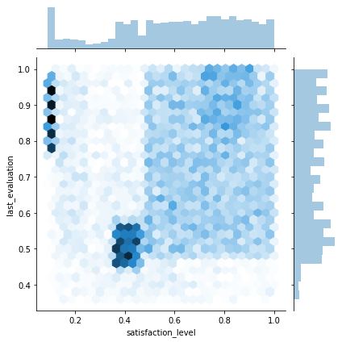

# Boston Housing Dataset analysis
This is the lesson from "Beginning Data Science with Python and Jupyter" by Alex Galea (Packt) - https://subscription.packtpub.com/book/big_data_and_business_intelligence/9781789532029


```python
# Load the dataset
from sklearn import datasets
boston = datasets.load_boston()
```


```python
# See the data structures type - hsould be a Bunch object
type(boston)
```


    sklearn.utils.Bunch


```python
# Find out more about bunch objects
from sklearn.utils import Bunch
Bunch?
```


```python
# Print the keys
boston.keys()
```


    dict_keys(['data', 'target', 'feature_names', 'DESCR', 'filename'])


```python
# Print the description
print(boston['DESCR'])
```

    .. _boston_dataset:
    
    Boston house prices dataset
    ---------------------------
    
    **Data Set Characteristics:**  
    
        :Number of Instances: 506 
    
        :Number of Attributes: 13 numeric/categorical predictive. Median Value (attribute 14) is usually the target.
    
        :Attribute Information (in order):
            - CRIM     per capita crime rate by town
            - ZN       proportion of residential land zoned for lots over 25,000 sq.ft.
            - INDUS    proportion of non-retail business acres per town
            - CHAS     Charles River dummy variable (= 1 if tract bounds river; 0 otherwise)
            - NOX      nitric oxides concentration (parts per 10 million)
            - RM       average number of rooms per dwelling
            - AGE      proportion of owner-occupied units built prior to 1940
            - DIS      weighted distances to five Boston employment centres
            - RAD      index of accessibility to radial highways
            - TAX      full-value property-tax rate per $10,000
            - PTRATIO  pupil-teacher ratio by town
            - B        1000(Bk - 0.63)^2 where Bk is the proportion of blacks by town
            - LSTAT    % lower status of the population
            - MEDV     Median value of owner-occupied homes in $1000's
    
        :Missing Attribute Values: None
    
        :Creator: Harrison, D. and Rubinfeld, D.L.
    
    This is a copy of UCI ML housing dataset.
    https://archive.ics.uci.edu/ml/machine-learning-databases/housing/
    
    
    This dataset was taken from the StatLib library which is maintained at Carnegie Mellon University.
    
    The Boston house-price data of Harrison, D. and Rubinfeld, D.L. 'Hedonic
    prices and the demand for clean air', J. Environ. Economics & Management,
    vol.5, 81-102, 1978.   Used in Belsley, Kuh & Welsch, 'Regression diagnostics
    ...', Wiley, 1980.   N.B. Various transformations are used in the table on
    pages 244-261 of the latter.
    
    The Boston house-price data has been used in many machine learning papers that address regression
    problems.   
         
    .. topic:: References
    
       - Belsley, Kuh & Welsch, 'Regression diagnostics: Identifying Influential Data and Sources of Collinearity', Wiley, 1980. 244-261.
       - Quinlan,R. (1993). Combining Instance-Based and Model-Based Learning. In Proceedings on the Tenth International Conference of Machine Learning, 236-243, University of Massachusetts, Amherst. Morgan Kaufmann.
    
    


```python
# Create a Pandas DataFrame to hold the data
# First show its init signature
import pandas as pd
pd.DataFrame?
```


```python
# Look at the data, shape and feature names
boston['data']
```


    array([[6.3200e-03, 1.8000e+01, 2.3100e+00, ..., 1.5300e+01, 3.9690e+02,
            4.9800e+00],
           [2.7310e-02, 0.0000e+00, 7.0700e+00, ..., 1.7800e+01, 3.9690e+02,
            9.1400e+00],
           [2.7290e-02, 0.0000e+00, 7.0700e+00, ..., 1.7800e+01, 3.9283e+02,
            4.0300e+00],
           ...,
           [6.0760e-02, 0.0000e+00, 1.1930e+01, ..., 2.1000e+01, 3.9690e+02,
            5.6400e+00],
           [1.0959e-01, 0.0000e+00, 1.1930e+01, ..., 2.1000e+01, 3.9345e+02,
            6.4800e+00],
           [4.7410e-02, 0.0000e+00, 1.1930e+01, ..., 2.1000e+01, 3.9690e+02,
            7.8800e+00]])


```python
boston['data'].shape
```


    (506, 13)


```python
boston['feature_names']
```


    array(['CRIM', 'ZN', 'INDUS', 'CHAS', 'NOX', 'RM', 'AGE', 'DIS', 'RAD',
           'TAX', 'PTRATIO', 'B', 'LSTAT'], dtype='<U7')


```python
# We know we have a 2D numpy array with 13 features and 506 samples. Let's load it into df
df = pd.DataFrame(data=boston['data'], columns=boston['feature_names'])
```


```python
# The "target" is what we are trying to predict
# For this exercise, median house prices in $1000s (MEDV). 
# Let's look at the target's shape
boston['target'].shape
```


    (506,)


```python
# Add the target variable to df
df['MEDV'] = boston['target']
```


```python
# We want the target at the front of our DataFrame to help us distinguish it from other features
# We introduce a dummy variable, remove the column and then concatenate it along the first axis
# axis = 0 to combine rows, axis = 1 (what we're doing here) for columns
y = df['MEDV'].copy()
del df['MEDV']
df = pd.concat((y, df), axis=1)
```


```python
# Have a look at the head, tail and length of the data for sanity checking
df.head()
```


<div>
<style scoped>
    .dataframe tbody tr th:only-of-type {
        vertical-align: middle;
    }

    .dataframe tbody tr th {
        vertical-align: top;
    }

    .dataframe thead th {
        text-align: right;
    }
</style>
<table border="1" class="dataframe">
  <thead>
    <tr style="text-align: right;">
      <th></th>
      <th>MEDV</th>
      <th>CRIM</th>
      <th>ZN</th>
      <th>INDUS</th>
      <th>CHAS</th>
      <th>NOX</th>
      <th>RM</th>
      <th>AGE</th>
      <th>DIS</th>
      <th>RAD</th>
      <th>TAX</th>
      <th>PTRATIO</th>
      <th>B</th>
      <th>LSTAT</th>
    </tr>
  </thead>
  <tbody>
    <tr>
      <th>0</th>
      <td>24.0</td>
      <td>0.00632</td>
      <td>18.0</td>
      <td>2.31</td>
      <td>0.0</td>
      <td>0.538</td>
      <td>6.575</td>
      <td>65.2</td>
      <td>4.0900</td>
      <td>1.0</td>
      <td>296.0</td>
      <td>15.3</td>
      <td>396.90</td>
      <td>4.98</td>
    </tr>
    <tr>
      <th>1</th>
      <td>21.6</td>
      <td>0.02731</td>
      <td>0.0</td>
      <td>7.07</td>
      <td>0.0</td>
      <td>0.469</td>
      <td>6.421</td>
      <td>78.9</td>
      <td>4.9671</td>
      <td>2.0</td>
      <td>242.0</td>
      <td>17.8</td>
      <td>396.90</td>
      <td>9.14</td>
    </tr>
    <tr>
      <th>2</th>
      <td>34.7</td>
      <td>0.02729</td>
      <td>0.0</td>
      <td>7.07</td>
      <td>0.0</td>
      <td>0.469</td>
      <td>7.185</td>
      <td>61.1</td>
      <td>4.9671</td>
      <td>2.0</td>
      <td>242.0</td>
      <td>17.8</td>
      <td>392.83</td>
      <td>4.03</td>
    </tr>
    <tr>
      <th>3</th>
      <td>33.4</td>
      <td>0.03237</td>
      <td>0.0</td>
      <td>2.18</td>
      <td>0.0</td>
      <td>0.458</td>
      <td>6.998</td>
      <td>45.8</td>
      <td>6.0622</td>
      <td>3.0</td>
      <td>222.0</td>
      <td>18.7</td>
      <td>394.63</td>
      <td>2.94</td>
    </tr>
    <tr>
      <th>4</th>
      <td>36.2</td>
      <td>0.06905</td>
      <td>0.0</td>
      <td>2.18</td>
      <td>0.0</td>
      <td>0.458</td>
      <td>7.147</td>
      <td>54.2</td>
      <td>6.0622</td>
      <td>3.0</td>
      <td>222.0</td>
      <td>18.7</td>
      <td>396.90</td>
      <td>5.33</td>
    </tr>
  </tbody>
</table>
</div>


```python
df.tail()
```


<div>
<style scoped>
    .dataframe tbody tr th:only-of-type {
        vertical-align: middle;
    }

    .dataframe tbody tr th {
        vertical-align: top;
    }

    .dataframe thead th {
        text-align: right;
    }
</style>
<table border="1" class="dataframe">
  <thead>
    <tr style="text-align: right;">
      <th></th>
      <th>MEDV</th>
      <th>CRIM</th>
      <th>ZN</th>
      <th>INDUS</th>
      <th>CHAS</th>
      <th>NOX</th>
      <th>RM</th>
      <th>AGE</th>
      <th>DIS</th>
      <th>RAD</th>
      <th>TAX</th>
      <th>PTRATIO</th>
      <th>B</th>
      <th>LSTAT</th>
    </tr>
  </thead>
  <tbody>
    <tr>
      <th>501</th>
      <td>22.4</td>
      <td>0.06263</td>
      <td>0.0</td>
      <td>11.93</td>
      <td>0.0</td>
      <td>0.573</td>
      <td>6.593</td>
      <td>69.1</td>
      <td>2.4786</td>
      <td>1.0</td>
      <td>273.0</td>
      <td>21.0</td>
      <td>391.99</td>
      <td>9.67</td>
    </tr>
    <tr>
      <th>502</th>
      <td>20.6</td>
      <td>0.04527</td>
      <td>0.0</td>
      <td>11.93</td>
      <td>0.0</td>
      <td>0.573</td>
      <td>6.120</td>
      <td>76.7</td>
      <td>2.2875</td>
      <td>1.0</td>
      <td>273.0</td>
      <td>21.0</td>
      <td>396.90</td>
      <td>9.08</td>
    </tr>
    <tr>
      <th>503</th>
      <td>23.9</td>
      <td>0.06076</td>
      <td>0.0</td>
      <td>11.93</td>
      <td>0.0</td>
      <td>0.573</td>
      <td>6.976</td>
      <td>91.0</td>
      <td>2.1675</td>
      <td>1.0</td>
      <td>273.0</td>
      <td>21.0</td>
      <td>396.90</td>
      <td>5.64</td>
    </tr>
    <tr>
      <th>504</th>
      <td>22.0</td>
      <td>0.10959</td>
      <td>0.0</td>
      <td>11.93</td>
      <td>0.0</td>
      <td>0.573</td>
      <td>6.794</td>
      <td>89.3</td>
      <td>2.3889</td>
      <td>1.0</td>
      <td>273.0</td>
      <td>21.0</td>
      <td>393.45</td>
      <td>6.48</td>
    </tr>
    <tr>
      <th>505</th>
      <td>11.9</td>
      <td>0.04741</td>
      <td>0.0</td>
      <td>11.93</td>
      <td>0.0</td>
      <td>0.573</td>
      <td>6.030</td>
      <td>80.8</td>
      <td>2.5050</td>
      <td>1.0</td>
      <td>273.0</td>
      <td>21.0</td>
      <td>396.90</td>
      <td>7.88</td>
    </tr>
  </tbody>
</table>
</div>


```python
len(df)
```


    506


```python
# See the data types for each column
# If variables are all floats and continuous variables (including the target), probs a regression problem
df.dtypes
```


    MEDV       float64
    CRIM       float64
    ZN         float64
    INDUS      float64
    CHAS       float64
    NOX        float64
    RM         float64
    AGE        float64
    DIS        float64
    RAD        float64
    TAX        float64
    PTRATIO    float64
    B          float64
    LSTAT      float64
    dtype: object


```python
# Clean up any NaN values - we identify them first
df.isnull().sum()
```


    MEDV       0
    CRIM       0
    ZN         0
    INDUS      0
    CHAS       0
    NOX        0
    RM         0
    AGE        0
    DIS        0
    RAD        0
    TAX        0
    PTRATIO    0
    B          0
    LSTAT      0
    dtype: int64


```python
# No NaNs to clean, but we want to remove some columns we won't be using for this particular exercise
for col in ['ZN', 'NOX', 'RAD', 'PTRATIO', 'B']:
    del df[col]
```


```python
# Describe quantitative data features
# The .T at the end swaps rows and columns
df.describe().T
```


<div>
<style scoped>
    .dataframe tbody tr th:only-of-type {
        vertical-align: middle;
    }

    .dataframe tbody tr th {
        vertical-align: top;
    }

    .dataframe thead th {
        text-align: right;
    }
</style>
<table border="1" class="dataframe">
  <thead>
    <tr style="text-align: right;">
      <th></th>
      <th>count</th>
      <th>mean</th>
      <th>std</th>
      <th>min</th>
      <th>25%</th>
      <th>50%</th>
      <th>75%</th>
      <th>max</th>
    </tr>
  </thead>
  <tbody>
    <tr>
      <th>MEDV</th>
      <td>506.0</td>
      <td>22.532806</td>
      <td>9.197104</td>
      <td>5.00000</td>
      <td>17.025000</td>
      <td>21.20000</td>
      <td>25.000000</td>
      <td>50.0000</td>
    </tr>
    <tr>
      <th>CRIM</th>
      <td>506.0</td>
      <td>3.613524</td>
      <td>8.601545</td>
      <td>0.00632</td>
      <td>0.082045</td>
      <td>0.25651</td>
      <td>3.677083</td>
      <td>88.9762</td>
    </tr>
    <tr>
      <th>INDUS</th>
      <td>506.0</td>
      <td>11.136779</td>
      <td>6.860353</td>
      <td>0.46000</td>
      <td>5.190000</td>
      <td>9.69000</td>
      <td>18.100000</td>
      <td>27.7400</td>
    </tr>
    <tr>
      <th>CHAS</th>
      <td>506.0</td>
      <td>0.069170</td>
      <td>0.253994</td>
      <td>0.00000</td>
      <td>0.000000</td>
      <td>0.00000</td>
      <td>0.000000</td>
      <td>1.0000</td>
    </tr>
    <tr>
      <th>RM</th>
      <td>506.0</td>
      <td>6.284634</td>
      <td>0.702617</td>
      <td>3.56100</td>
      <td>5.885500</td>
      <td>6.20850</td>
      <td>6.623500</td>
      <td>8.7800</td>
    </tr>
    <tr>
      <th>AGE</th>
      <td>506.0</td>
      <td>68.574901</td>
      <td>28.148861</td>
      <td>2.90000</td>
      <td>45.025000</td>
      <td>77.50000</td>
      <td>94.075000</td>
      <td>100.0000</td>
    </tr>
    <tr>
      <th>DIS</th>
      <td>506.0</td>
      <td>3.795043</td>
      <td>2.105710</td>
      <td>1.12960</td>
      <td>2.100175</td>
      <td>3.20745</td>
      <td>5.188425</td>
      <td>12.1265</td>
    </tr>
    <tr>
      <th>TAX</th>
      <td>506.0</td>
      <td>408.237154</td>
      <td>168.537116</td>
      <td>187.00000</td>
      <td>279.000000</td>
      <td>330.00000</td>
      <td>666.000000</td>
      <td>711.0000</td>
    </tr>
    <tr>
      <th>LSTAT</th>
      <td>506.0</td>
      <td>12.653063</td>
      <td>7.141062</td>
      <td>1.73000</td>
      <td>6.950000</td>
      <td>11.36000</td>
      <td>16.955000</td>
      <td>37.9700</td>
    </tr>
  </tbody>
</table>
</div>


```python
# We are focusing on rooms per dwelling, age, tax rate, lower status and median value
# Make it a subset
cols = ['RM', 'AGE', 'TAX', 'LSTAT', 'MEDV']
df[cols].head()
```


<div>
<style scoped>
    .dataframe tbody tr th:only-of-type {
        vertical-align: middle;
    }

    .dataframe tbody tr th {
        vertical-align: top;
    }

    .dataframe thead th {
        text-align: right;
    }
</style>
<table border="1" class="dataframe">
  <thead>
    <tr style="text-align: right;">
      <th></th>
      <th>RM</th>
      <th>AGE</th>
      <th>TAX</th>
      <th>LSTAT</th>
      <th>MEDV</th>
    </tr>
  </thead>
  <tbody>
    <tr>
      <th>0</th>
      <td>6.575</td>
      <td>65.2</td>
      <td>296.0</td>
      <td>4.98</td>
      <td>24.0</td>
    </tr>
    <tr>
      <th>1</th>
      <td>6.421</td>
      <td>78.9</td>
      <td>242.0</td>
      <td>9.14</td>
      <td>21.6</td>
    </tr>
    <tr>
      <th>2</th>
      <td>7.185</td>
      <td>61.1</td>
      <td>242.0</td>
      <td>4.03</td>
      <td>34.7</td>
    </tr>
    <tr>
      <th>3</th>
      <td>6.998</td>
      <td>45.8</td>
      <td>222.0</td>
      <td>2.94</td>
      <td>33.4</td>
    </tr>
    <tr>
      <th>4</th>
      <td>7.147</td>
      <td>54.2</td>
      <td>222.0</td>
      <td>5.33</td>
      <td>36.2</td>
    </tr>
  </tbody>
</table>
</div>


```python
# Calculate pairwise correlations for this subset to start looking for patterns
# Large positive scores show strong positive correlation.
# 1 is the max value and is shown in the diagonals where we're comparing the same data with itself
df[cols].corr()
```


<div>
<style scoped>
    .dataframe tbody tr th:only-of-type {
        vertical-align: middle;
    }

    .dataframe tbody tr th {
        vertical-align: top;
    }

    .dataframe thead th {
        text-align: right;
    }
</style>
<table border="1" class="dataframe">
  <thead>
    <tr style="text-align: right;">
      <th></th>
      <th>RM</th>
      <th>AGE</th>
      <th>TAX</th>
      <th>LSTAT</th>
      <th>MEDV</th>
    </tr>
  </thead>
  <tbody>
    <tr>
      <th>RM</th>
      <td>1.000000</td>
      <td>-0.240265</td>
      <td>-0.292048</td>
      <td>-0.613808</td>
      <td>0.695360</td>
    </tr>
    <tr>
      <th>AGE</th>
      <td>-0.240265</td>
      <td>1.000000</td>
      <td>0.506456</td>
      <td>0.602339</td>
      <td>-0.376955</td>
    </tr>
    <tr>
      <th>TAX</th>
      <td>-0.292048</td>
      <td>0.506456</td>
      <td>1.000000</td>
      <td>0.543993</td>
      <td>-0.468536</td>
    </tr>
    <tr>
      <th>LSTAT</th>
      <td>-0.613808</td>
      <td>0.602339</td>
      <td>0.543993</td>
      <td>1.000000</td>
      <td>-0.737663</td>
    </tr>
    <tr>
      <th>MEDV</th>
      <td>0.695360</td>
      <td>-0.376955</td>
      <td>-0.468536</td>
      <td>-0.737663</td>
      <td>1.000000</td>
    </tr>
  </tbody>
</table>
</div>


```python
# Visualise the data with a heatmap using matplotlib and seaborn
import matplotlib.pyplot as plt
import seaborn as sns
%matplotlib inline
ax = sns.heatmap(df[cols].corr(), cmap=sns.cubehelix_palette(20, light=0.95, dark=0.15))
ax.xaxis.tick_top() # Move labels to top
plt.show()
```


```python
# Visualise the dataframe using Seaborn's pairplot function
sns.pairplot(df[cols], plot_kws={'alpha': 0.6}, diag_kws={'bins': 30})
```


    <seaborn.axisgrid.PairGrid at 0x1ed52ca2f88>





```python
# For this exercise, we will focus on trying to predict MEDV using RM and LSTAT
# First, visualise the relationships using Seaborn by drawing scatter plots with linear models
# Seaborn automatically uses the ordinary least squares error function when we call regplot to show the line
fig, ax = plt.subplots(1, 2)
sns.regplot('RM', 'MEDV', df, ax=ax[0], scatter_kws={'alpha': 0.4})
sns.regplot('LSTAT', 'MEDV', df, ax=ax[1], scatter_kws={'alpha': 0.4})
```


    <matplotlib.axes._subplots.AxesSubplot at 0x1ed53cd67c8>


```python
# Plot the residuals for the relationships 
# Each point here is the difference between a sample value and a linear model prediction
# Patterns here show suboptimal modelling - we expect diagonally arranged scatter points due to the $50k cap on MEDV
# RM data will be clustered around zero (save for the diagonal) - a good fit
# LSTAT data will be clustered lower than zero
fig, ax = plt.subplots(1, 2)
ax[0] = sns.residplot('RM','MEDV', df, ax=ax[0], scatter_kws={'alpha': 0.4})
ax[0].set_ylabel('MEDV residuals $(y-\hat{y})$')
ax[1] = sns.residplot('LSTAT','MEDV', df, ax=ax[1], scatter_kws={'alpha': 0.4})
ax[1].set_ylabel('')
```


    Text(0, 0.5, '')


```python
# Rather than visualising the fit, we can quantify using mean squared error using scikit-learn
from sklearn.linear_model import LinearRegression
from sklearn.metrics import mean_squared_error

def get_mse(df, feature, target='MEDV'):
    # Get x, y to model
    y = df[target].values # Calling the values attribute casts these as numpy arrays
    x = df[feature].values.reshape(-1, 1) # We reshape the dependent features array as we are using a 1D feature space
    print('{} ~ {}'.format(target, feature))
    
    # Build and fit the model
    lm = LinearRegression()
    lm.fit(x, y)
    msg = 'Model: y={:.3f} + {:.3f}x'.format(lm.intercept_, lm.coef_[0])
    print(msg)
    
    # Predict and determine MSE
    y_pred = lm.predict(x)
    error = mean_squared_error(y, y_pred)
    print('MSE = {:.2f}'.format(error))
    print()
```


```python
get_mse(df, 'RM')
get_mse(df, 'LSTAT')
```

    MEDV ~ RM
    Model: y=-34.671 + 9.102x
    MSE = 43.60
    
    MEDV ~ LSTAT
    Model: y=34.554 + -0.950x
    MSE = 38.48
    
    


```python
# We will try a polynomial model and compare it with the regression model 
# We'll use a 3rd order polynomial model and compare its MSE with the previous one
# For this exercise, we are just using LSTAT

# First, pull our dependent feature and target vars
y = df['MEDV'].values
x = df['LSTAT'].values.reshape(-1, 1)

# Print some samples
# Note that each array item is an array itself - this is what reshape does and scikit-learn expects
print('x=')
print(x[:3], '...etc')
```

    x=
    [[4.98]
     [9.14]
     [4.03]] ...etc
    


```python
# Import the transformation tools and initialise the polynomial feature transformer
from sklearn.preprocessing import PolynomialFeatures
poly = PolynomialFeatures(degree=3)
```


```python
# Transform LSTAT (stored in x)
x_poly = poly.fit_transform(x)

# Print samples
print('x_poly = ')
print(x_poly[:3], '...etc')

# Note that these will be transformed to x^0, x^1, x^2 and x^3
```

    x_poly = 
    [[  1.         4.98      24.8004   123.505992]
     [  1.         9.14      83.5396   763.551944]
     [  1.         4.03      16.2409    65.450827]] ...etc
    


```python
# We now use the polynomial data to fit a linear model
from sklearn.linear_model import LinearRegression
clf = LinearRegression()
clf.fit(x_poly, y)
```


    LinearRegression(copy_X=True, fit_intercept=True, n_jobs=None, normalize=False)


```python
# Extract the coefficients and print the polynomial model
a_0 = clf.intercept_ + clf.coef_[0] # Intercept
a_1, a_2, a_3 = clf.coef_[1:] # Other coefficients
msg = 'model: y = {:.3f} + {:.3f}x + {:.3f}x^2 + {:.3f}x^3'.format(a_0, a_1, a_2, a_3)
print(msg)
```

    model: y = 48.650 + -3.866x + 0.149x^2 + -0.002x^3
    


```python
# Determine predicted values for each sample and calculate residuals
y_pred = clf.predict(x_poly)
resid_MEDV = y - y_pred

# Print some
print('residuals=')
print(resid_MEDV[:10], '...etc')
```

    residuals=
    [-8.84025736 -2.61360313 -0.65577837 -5.11949581  4.23191217 -3.56387056
      3.16728909 12.00336372  4.03348935  2.87915437] ...etc
    


```python
# Calculate the MSE for the polynomial model
from sklearn.metrics import mean_squared_error
error = mean_squared_error(y, y_pred)
print('MSE = {:.2f}'.format(error))
```

    MSE = 28.88
    


```python
# Plot the polynomial model to show the line of best fit against the scattergraph
import numpy as np
fig, ax = plt.subplots()
# Plot samples
ax.scatter(x.flatten(), y, alpha=0.6)
# Plot the polynomial model
x_ = np.linspace(2, 38, 50).reshape(-1, 1) # The red curve is from 50 values evenly arranged between 2 and 38
x_poly = poly.fit_transform(x_)
y_ = clf.predict(x_poly)
ax.plot(x_, y_, color='red', alpha=0.8)
ax.set_xlabel('LSTAT'); ax.set_ylabel('MEDV');
```


```python
# Plot the residuals for this model
fix, ax = plt.subplots(figsize=(5, 7))
ax.scatter(x, resid_MEDV, alpha=0.6)
ax.set_xlabel('LSTAT')
ax.set_ylabel('MEDV Residual $(y-\hat{y})$')
plt.axhline(0, color='black', ls='dotted')
```


    <matplotlib.lines.Line2D at 0x1ed55403dc8>


## DAY 2: Continuation of Tutorial - Using Categorical Features for Segmentation Analysis
This is a continuation of material linked above conducted on 26/06/2020 - next day of #100DaysOfCode

This will involve the creation of categorical fields. Up until now, we've worked on continuous fields but we want to find patterns by segmenting continuous variables with categorical fields - this may yield more insights.

We don't have categorical fields in the Boston Housing dataset so we make one by making a continuous field discrete - we'll do this by binning the data into low, medium and high categories. 

#### Note that binning done properly can reveal insights from the data that are otherwise difficult to notice or unavailable.

If we look at the dataset graph for AGE vs other variables, (Out [24]), this shows the proportion of owner-occupied units built prior to 1940. We will make this a categorical variable and replot it with colour coding.


```python
import seaborn as sns
import matplotlib.pyplot as plt
```


```python
# Let's do a distribution plot with some lines
sns.distplot(df.AGE.values, bins=100, hist_kws={'cumulative': True}, kde_kws={'lw':0})
plt.xlabel('AGE')
plt.ylabel('CDF')
plt.axhline(0.33, color='red')
plt.axhline(0.66, color='red')
plt.xlim(0, df.AGE.max());
```


#### We set kde_kws={'lw':0} to bypass plotting kernel density estimate

### Analysis
We don't have many samples with low AGE, but there are more with large AGE.
This is shown by curve steepness on the right
We can see that only about 33% of the samples have AGE < 55 and 33% have AGE > 90
So a third of the housing communities have less than 55% of homes built before 1940.
These communities are new. But on the other hand, a 1/3 of the community is old, where over 90% of the houses were built before 1940.

### Methodology 
##### We will use the red line distribution points to split the feature data into discrete categories: Newer, Old and Very Old


```python
# Function to output category to which AGE belongs
def get_age_category(x):
    if x < 50:
        return 'Newer'
    elif 50 <= x < 85:
        return 'Old'
    else:
        return 'Very Old'

# Run it - the Pandas apply method applies a function to a given column or set thereof
# We assign the output to its own category
df['AGE_category'] = df.AGE.apply(get_age_category)
```


```python
# Check the segmented counts
df.groupby('AGE_category').size()
```


    AGE_category
    Newer       147
    Old         149
    Very Old    210
    dtype: int64


### Analysis
The two newer class sizes are equal, but there's heaps of very old buildings.
#### The Very Old group is about 40% bigger.

### We want to try assign samples evenly so we can make statistically significant claims about the data.
Even though this is not always possible, it is more difficult to make claims re: the under-represented class.

##### Predictive analytics with imbalanced classes can be especially difficult - see: [this blog post]: (https://svds.com/learning-imbalanced-classes/.)

### For demonstration, we will do a violin plot with our existing classes


```python
sns.violinplot(x='MEDV', y='AGE_category', data=df, order=['Newer', 'Old', 'Very Old']);
```


### Analysis
The violin plots show a normal distribution. The Very Old group is cheapest and has a large width, wholst the others are tighter.
The young group is skewed to the more expensive.

### What the graph features show
- The violins themselves show kernel density. 
- The white dot in the middle is the mean.
- The thick black line either side of the dot goes to the first quantile either side of the white dot.
- The thinner line is boxplot whiskers - 95% of the population. 
##### We can use inner='point' to sns.violinplot() to show individual data points.


```python
sns.violinplot(x='MEDV', y='AGE_category', data=df, order=['Newer', 'Old', 'Very Old'], inner='point');
```


### Analysis
This shows us that there are no median prices below about $16k for the Newer segment. The tail therefore has no data.

##### Let's redo the earlier graphs but with specific colours for each AGE category.


```python
cols = ['RM', 'AGE', 'TAX', 'LSTAT', 'MEDV', 'AGE_category']
sns.pairplot(df[cols], hue='AGE_category', hue_order=['Newer','Old','Very Old'], plot_kws={'alpha':0.5})
```


    <seaborn.axisgrid.PairGrid at 0x1ed5568b388>


```python
# Although RM and TAX distributions seem similar, LSTAT ones are different.
# Let's focus on them using a violin plot
sns.violinplot(data=df, x='LSTAT', y='AGE_category', order=['Newer', 'Old', 'Very Old'])
```


    <matplotlib.axes._subplots.AxesSubplot at 0x1ed55d44608>


### Analysis
Unlike the MEDV plot where the distributions had rougly the same width, here we see the width increasing with AGE. In other words, the Very Old segment contains anywhere between very few to many lower socio-economic class residents, whilst the relatively new communities are more likely to be privileged - over 95% of the samples have less lower class percentage than the Very Old group. This could be because Newer neighbourhoods on the whole have more expensive properties.

## My Own Exercise: Comparing price to air quality
To finish off today, I'll plot some graphs and make some comments re: a correlation that isn't discussed above - air quality (NOX) and MEDV just to recap. 


```python
# Load the dataset again and include only NOX And MEDV
# Make sure Boston is still loaded
print(boston)
```

    {'data': array([[6.3200e-03, 1.8000e+01, 2.3100e+00, ..., 1.5300e+01, 3.9690e+02,
            4.9800e+00],
           [2.7310e-02, 0.0000e+00, 7.0700e+00, ..., 1.7800e+01, 3.9690e+02,
            9.1400e+00],
           [2.7290e-02, 0.0000e+00, 7.0700e+00, ..., 1.7800e+01, 3.9283e+02,
            4.0300e+00],
           ...,
           [6.0760e-02, 0.0000e+00, 1.1930e+01, ..., 2.1000e+01, 3.9690e+02,
            5.6400e+00],
           [1.0959e-01, 0.0000e+00, 1.1930e+01, ..., 2.1000e+01, 3.9345e+02,
            6.4800e+00],
           [4.7410e-02, 0.0000e+00, 1.1930e+01, ..., 2.1000e+01, 3.9690e+02,
            7.8800e+00]]), 'target': array([24. , 21.6, 34.7, 33.4, 36.2, 28.7, 22.9, 27.1, 16.5, 18.9, 15. ,
           18.9, 21.7, 20.4, 18.2, 19.9, 23.1, 17.5, 20.2, 18.2, 13.6, 19.6,
           15.2, 14.5, 15.6, 13.9, 16.6, 14.8, 18.4, 21. , 12.7, 14.5, 13.2,
           13.1, 13.5, 18.9, 20. , 21. , 24.7, 30.8, 34.9, 26.6, 25.3, 24.7,
           21.2, 19.3, 20. , 16.6, 14.4, 19.4, 19.7, 20.5, 25. , 23.4, 18.9,
           35.4, 24.7, 31.6, 23.3, 19.6, 18.7, 16. , 22.2, 25. , 33. , 23.5,
           19.4, 22. , 17.4, 20.9, 24.2, 21.7, 22.8, 23.4, 24.1, 21.4, 20. ,
           20.8, 21.2, 20.3, 28. , 23.9, 24.8, 22.9, 23.9, 26.6, 22.5, 22.2,
           23.6, 28.7, 22.6, 22. , 22.9, 25. , 20.6, 28.4, 21.4, 38.7, 43.8,
           33.2, 27.5, 26.5, 18.6, 19.3, 20.1, 19.5, 19.5, 20.4, 19.8, 19.4,
           21.7, 22.8, 18.8, 18.7, 18.5, 18.3, 21.2, 19.2, 20.4, 19.3, 22. ,
           20.3, 20.5, 17.3, 18.8, 21.4, 15.7, 16.2, 18. , 14.3, 19.2, 19.6,
           23. , 18.4, 15.6, 18.1, 17.4, 17.1, 13.3, 17.8, 14. , 14.4, 13.4,
           15.6, 11.8, 13.8, 15.6, 14.6, 17.8, 15.4, 21.5, 19.6, 15.3, 19.4,
           17. , 15.6, 13.1, 41.3, 24.3, 23.3, 27. , 50. , 50. , 50. , 22.7,
           25. , 50. , 23.8, 23.8, 22.3, 17.4, 19.1, 23.1, 23.6, 22.6, 29.4,
           23.2, 24.6, 29.9, 37.2, 39.8, 36.2, 37.9, 32.5, 26.4, 29.6, 50. ,
           32. , 29.8, 34.9, 37. , 30.5, 36.4, 31.1, 29.1, 50. , 33.3, 30.3,
           34.6, 34.9, 32.9, 24.1, 42.3, 48.5, 50. , 22.6, 24.4, 22.5, 24.4,
           20. , 21.7, 19.3, 22.4, 28.1, 23.7, 25. , 23.3, 28.7, 21.5, 23. ,
           26.7, 21.7, 27.5, 30.1, 44.8, 50. , 37.6, 31.6, 46.7, 31.5, 24.3,
           31.7, 41.7, 48.3, 29. , 24. , 25.1, 31.5, 23.7, 23.3, 22. , 20.1,
           22.2, 23.7, 17.6, 18.5, 24.3, 20.5, 24.5, 26.2, 24.4, 24.8, 29.6,
           42.8, 21.9, 20.9, 44. , 50. , 36. , 30.1, 33.8, 43.1, 48.8, 31. ,
           36.5, 22.8, 30.7, 50. , 43.5, 20.7, 21.1, 25.2, 24.4, 35.2, 32.4,
           32. , 33.2, 33.1, 29.1, 35.1, 45.4, 35.4, 46. , 50. , 32.2, 22. ,
           20.1, 23.2, 22.3, 24.8, 28.5, 37.3, 27.9, 23.9, 21.7, 28.6, 27.1,
           20.3, 22.5, 29. , 24.8, 22. , 26.4, 33.1, 36.1, 28.4, 33.4, 28.2,
           22.8, 20.3, 16.1, 22.1, 19.4, 21.6, 23.8, 16.2, 17.8, 19.8, 23.1,
           21. , 23.8, 23.1, 20.4, 18.5, 25. , 24.6, 23. , 22.2, 19.3, 22.6,
           19.8, 17.1, 19.4, 22.2, 20.7, 21.1, 19.5, 18.5, 20.6, 19. , 18.7,
           32.7, 16.5, 23.9, 31.2, 17.5, 17.2, 23.1, 24.5, 26.6, 22.9, 24.1,
           18.6, 30.1, 18.2, 20.6, 17.8, 21.7, 22.7, 22.6, 25. , 19.9, 20.8,
           16.8, 21.9, 27.5, 21.9, 23.1, 50. , 50. , 50. , 50. , 50. , 13.8,
           13.8, 15. , 13.9, 13.3, 13.1, 10.2, 10.4, 10.9, 11.3, 12.3,  8.8,
            7.2, 10.5,  7.4, 10.2, 11.5, 15.1, 23.2,  9.7, 13.8, 12.7, 13.1,
           12.5,  8.5,  5. ,  6.3,  5.6,  7.2, 12.1,  8.3,  8.5,  5. , 11.9,
           27.9, 17.2, 27.5, 15. , 17.2, 17.9, 16.3,  7. ,  7.2,  7.5, 10.4,
            8.8,  8.4, 16.7, 14.2, 20.8, 13.4, 11.7,  8.3, 10.2, 10.9, 11. ,
            9.5, 14.5, 14.1, 16.1, 14.3, 11.7, 13.4,  9.6,  8.7,  8.4, 12.8,
           10.5, 17.1, 18.4, 15.4, 10.8, 11.8, 14.9, 12.6, 14.1, 13. , 13.4,
           15.2, 16.1, 17.8, 14.9, 14.1, 12.7, 13.5, 14.9, 20. , 16.4, 17.7,
           19.5, 20.2, 21.4, 19.9, 19. , 19.1, 19.1, 20.1, 19.9, 19.6, 23.2,
           29.8, 13.8, 13.3, 16.7, 12. , 14.6, 21.4, 23. , 23.7, 25. , 21.8,
           20.6, 21.2, 19.1, 20.6, 15.2,  7. ,  8.1, 13.6, 20.1, 21.8, 24.5,
           23.1, 19.7, 18.3, 21.2, 17.5, 16.8, 22.4, 20.6, 23.9, 22. , 11.9]), 'feature_names': array(['CRIM', 'ZN', 'INDUS', 'CHAS', 'NOX', 'RM', 'AGE', 'DIS', 'RAD',
           'TAX', 'PTRATIO', 'B', 'LSTAT'], dtype='<U7'), 'DESCR': ".. _boston_dataset:\n\nBoston house prices dataset\n---------------------------\n\n**Data Set Characteristics:**  \n\n    :Number of Instances: 506 \n\n    :Number of Attributes: 13 numeric/categorical predictive. Median Value (attribute 14) is usually the target.\n\n    :Attribute Information (in order):\n        - CRIM     per capita crime rate by town\n        - ZN       proportion of residential land zoned for lots over 25,000 sq.ft.\n        - INDUS    proportion of non-retail business acres per town\n        - CHAS     Charles River dummy variable (= 1 if tract bounds river; 0 otherwise)\n        - NOX      nitric oxides concentration (parts per 10 million)\n        - RM       average number of rooms per dwelling\n        - AGE      proportion of owner-occupied units built prior to 1940\n        - DIS      weighted distances to five Boston employment centres\n        - RAD      index of accessibility to radial highways\n        - TAX      full-value property-tax rate per $10,000\n        - PTRATIO  pupil-teacher ratio by town\n        - B        1000(Bk - 0.63)^2 where Bk is the proportion of blacks by town\n        - LSTAT    % lower status of the population\n        - MEDV     Median value of owner-occupied homes in $1000's\n\n    :Missing Attribute Values: None\n\n    :Creator: Harrison, D. and Rubinfeld, D.L.\n\nThis is a copy of UCI ML housing dataset.\nhttps://archive.ics.uci.edu/ml/machine-learning-databases/housing/\n\n\nThis dataset was taken from the StatLib library which is maintained at Carnegie Mellon University.\n\nThe Boston house-price data of Harrison, D. and Rubinfeld, D.L. 'Hedonic\nprices and the demand for clean air', J. Environ. Economics & Management,\nvol.5, 81-102, 1978.   Used in Belsley, Kuh & Welsch, 'Regression diagnostics\n...', Wiley, 1980.   N.B. Various transformations are used in the table on\npages 244-261 of the latter.\n\nThe Boston house-price data has been used in many machine learning papers that address regression\nproblems.   \n     \n.. topic:: References\n\n   - Belsley, Kuh & Welsch, 'Regression diagnostics: Identifying Influential Data and Sources of Collinearity', Wiley, 1980. 244-261.\n   - Quinlan,R. (1993). Combining Instance-Based and Model-Based Learning. In Proceedings on the Tenth International Conference of Machine Learning, 236-243, University of Massachusetts, Amherst. Morgan Kaufmann.\n", 'filename': 'C:\\Users\\MateMalice\\.conda\\envs\\machine-learning-for-pentesting\\lib\\site-packages\\sklearn\\datasets\\data\\boston_house_prices.csv'}
    


```python
# Make a new Pandas DataFrame but only leave in the two columns we're looking at
df_air = pd.DataFrame(data=boston['data'], columns=boston['feature_names'])
```


```python
df_air['MEDV'] = boston['target']
y = df_air['MEDV'].copy()
del df_air['MEDV']
df_air = pd.concat((y, df_air), axis=1)
```


```python
df_air.tail()
```


<div>
<style scoped>
    .dataframe tbody tr th:only-of-type {
        vertical-align: middle;
    }

    .dataframe tbody tr th {
        vertical-align: top;
    }

    .dataframe thead th {
        text-align: right;
    }
</style>
<table border="1" class="dataframe">
  <thead>
    <tr style="text-align: right;">
      <th></th>
      <th>MEDV</th>
      <th>CRIM</th>
      <th>ZN</th>
      <th>INDUS</th>
      <th>CHAS</th>
      <th>NOX</th>
      <th>RM</th>
      <th>AGE</th>
      <th>DIS</th>
      <th>RAD</th>
      <th>TAX</th>
      <th>PTRATIO</th>
      <th>B</th>
      <th>LSTAT</th>
    </tr>
  </thead>
  <tbody>
    <tr>
      <th>501</th>
      <td>22.4</td>
      <td>0.06263</td>
      <td>0.0</td>
      <td>11.93</td>
      <td>0.0</td>
      <td>0.573</td>
      <td>6.593</td>
      <td>69.1</td>
      <td>2.4786</td>
      <td>1.0</td>
      <td>273.0</td>
      <td>21.0</td>
      <td>391.99</td>
      <td>9.67</td>
    </tr>
    <tr>
      <th>502</th>
      <td>20.6</td>
      <td>0.04527</td>
      <td>0.0</td>
      <td>11.93</td>
      <td>0.0</td>
      <td>0.573</td>
      <td>6.120</td>
      <td>76.7</td>
      <td>2.2875</td>
      <td>1.0</td>
      <td>273.0</td>
      <td>21.0</td>
      <td>396.90</td>
      <td>9.08</td>
    </tr>
    <tr>
      <th>503</th>
      <td>23.9</td>
      <td>0.06076</td>
      <td>0.0</td>
      <td>11.93</td>
      <td>0.0</td>
      <td>0.573</td>
      <td>6.976</td>
      <td>91.0</td>
      <td>2.1675</td>
      <td>1.0</td>
      <td>273.0</td>
      <td>21.0</td>
      <td>396.90</td>
      <td>5.64</td>
    </tr>
    <tr>
      <th>504</th>
      <td>22.0</td>
      <td>0.10959</td>
      <td>0.0</td>
      <td>11.93</td>
      <td>0.0</td>
      <td>0.573</td>
      <td>6.794</td>
      <td>89.3</td>
      <td>2.3889</td>
      <td>1.0</td>
      <td>273.0</td>
      <td>21.0</td>
      <td>393.45</td>
      <td>6.48</td>
    </tr>
    <tr>
      <th>505</th>
      <td>11.9</td>
      <td>0.04741</td>
      <td>0.0</td>
      <td>11.93</td>
      <td>0.0</td>
      <td>0.573</td>
      <td>6.030</td>
      <td>80.8</td>
      <td>2.5050</td>
      <td>1.0</td>
      <td>273.0</td>
      <td>21.0</td>
      <td>396.90</td>
      <td>7.88</td>
    </tr>
  </tbody>
</table>
</div>


```python
len(df_air)
```


    506


```python
for col in ['CRIM', 'TAX', 'ZN', 'INDUS', 'CHAS', 'RM','DIS','RAD','PTRATIO','B','LSTAT']:
    del df_air[col]
```


```python
df_air.describe().T
```


<div>
<style scoped>
    .dataframe tbody tr th:only-of-type {
        vertical-align: middle;
    }

    .dataframe tbody tr th {
        vertical-align: top;
    }

    .dataframe thead th {
        text-align: right;
    }
</style>
<table border="1" class="dataframe">
  <thead>
    <tr style="text-align: right;">
      <th></th>
      <th>count</th>
      <th>mean</th>
      <th>std</th>
      <th>min</th>
      <th>25%</th>
      <th>50%</th>
      <th>75%</th>
      <th>max</th>
    </tr>
  </thead>
  <tbody>
    <tr>
      <th>MEDV</th>
      <td>506.0</td>
      <td>22.532806</td>
      <td>9.197104</td>
      <td>5.000</td>
      <td>17.025</td>
      <td>21.200</td>
      <td>25.000</td>
      <td>50.000</td>
    </tr>
    <tr>
      <th>NOX</th>
      <td>506.0</td>
      <td>0.554695</td>
      <td>0.115878</td>
      <td>0.385</td>
      <td>0.449</td>
      <td>0.538</td>
      <td>0.624</td>
      <td>0.871</td>
    </tr>
    <tr>
      <th>AGE</th>
      <td>506.0</td>
      <td>68.574901</td>
      <td>28.148861</td>
      <td>2.900</td>
      <td>45.025</td>
      <td>77.500</td>
      <td>94.075</td>
      <td>100.000</td>
    </tr>
  </tbody>
</table>
</div>


```python
# Let's configure the subset of features we are keeping
cols = ['NOX','AGE','MEDV']
df_air[cols]
```


<div>
<style scoped>
    .dataframe tbody tr th:only-of-type {
        vertical-align: middle;
    }

    .dataframe tbody tr th {
        vertical-align: top;
    }

    .dataframe thead th {
        text-align: right;
    }
</style>
<table border="1" class="dataframe">
  <thead>
    <tr style="text-align: right;">
      <th></th>
      <th>NOX</th>
      <th>AGE</th>
      <th>MEDV</th>
    </tr>
  </thead>
  <tbody>
    <tr>
      <th>0</th>
      <td>0.538</td>
      <td>65.2</td>
      <td>24.0</td>
    </tr>
    <tr>
      <th>1</th>
      <td>0.469</td>
      <td>78.9</td>
      <td>21.6</td>
    </tr>
    <tr>
      <th>2</th>
      <td>0.469</td>
      <td>61.1</td>
      <td>34.7</td>
    </tr>
    <tr>
      <th>3</th>
      <td>0.458</td>
      <td>45.8</td>
      <td>33.4</td>
    </tr>
    <tr>
      <th>4</th>
      <td>0.458</td>
      <td>54.2</td>
      <td>36.2</td>
    </tr>
    <tr>
      <th>...</th>
      <td>...</td>
      <td>...</td>
      <td>...</td>
    </tr>
    <tr>
      <th>501</th>
      <td>0.573</td>
      <td>69.1</td>
      <td>22.4</td>
    </tr>
    <tr>
      <th>502</th>
      <td>0.573</td>
      <td>76.7</td>
      <td>20.6</td>
    </tr>
    <tr>
      <th>503</th>
      <td>0.573</td>
      <td>91.0</td>
      <td>23.9</td>
    </tr>
    <tr>
      <th>504</th>
      <td>0.573</td>
      <td>89.3</td>
      <td>22.0</td>
    </tr>
    <tr>
      <th>505</th>
      <td>0.573</td>
      <td>80.8</td>
      <td>11.9</td>
    </tr>
  </tbody>
</table>
<p>506 rows × 3 columns</p>
</div>


```python
# Calculate pairwise correlations
df_air[cols].corr()
```


<div>
<style scoped>
    .dataframe tbody tr th:only-of-type {
        vertical-align: middle;
    }

    .dataframe tbody tr th {
        vertical-align: top;
    }

    .dataframe thead th {
        text-align: right;
    }
</style>
<table border="1" class="dataframe">
  <thead>
    <tr style="text-align: right;">
      <th></th>
      <th>NOX</th>
      <th>AGE</th>
      <th>MEDV</th>
    </tr>
  </thead>
  <tbody>
    <tr>
      <th>NOX</th>
      <td>1.000000</td>
      <td>0.731470</td>
      <td>-0.427321</td>
    </tr>
    <tr>
      <th>AGE</th>
      <td>0.731470</td>
      <td>1.000000</td>
      <td>-0.376955</td>
    </tr>
    <tr>
      <th>MEDV</th>
      <td>-0.427321</td>
      <td>-0.376955</td>
      <td>1.000000</td>
    </tr>
  </tbody>
</table>
</div>


### Analysis
Strong pairwise correlation between AGE and NO2 concentration, so older is more likely to have higher NOX. Also, negative pairwise correlation between value and NOX concentration, so more expensive places have cleaner air. 


```python
# Show a heatmap
import matplotlib.pyplot as plt
import seaborn as sns
%matplotlib inline
ax = sns.heatmap(df_air[cols].corr(), cmap=sns.cubehelix_palette(20, light=0.95, dark=0.15))
ax.xaxis.tick_top()
plt.show()
```


```python
# Show pairplots
sns.pairplot(df_air[cols], plot_kws={'alpha': 0.6}, diag_kws={'bins':30})
```


    <seaborn.axisgrid.PairGrid at 0x1ed56184cc8>


### Analysis
It seems that the NOX distribution is fairly even, though skewed to the right. There is a clear lack of samples in the 0.75-0.8 range, but there's heaps in a single the >0.8 bin.
Comparing NOX with age, we can see that the highest age group (where the data cuts off - no more bins after this) seem to have more NOX. Likewise, with MEDV, there is the opposite trend - higher MEDV means lower NOX.

  ##### Linear Regression follows


```python
fig, ax = plt.subplots(1, 2)
# We automatically use the least-square-mean error function with Seaborn
sns.regplot('NOX','MEDV', df_air, ax=ax[0], scatter_kws={'alpha':0.4})
sns.regplot('AGE','NOX', df_air, ax=ax[1], scatter_kws={'alpha': 0.4})
```


    <matplotlib.axes._subplots.AxesSubplot at 0x1ed56c22dc8>


```python
# Time to plot the residuals
fig, ax = plt.subplots(1, 2)
ax[0] = sns.residplot('NOX','MEDV', df_air, ax=ax[0], scatter_kws={'alpha':0.4})
ax[0].set_ylabel('MEDV residuals $(y-\hat{y})$')
ax[1] = sns.residplot('AGE','NOX', df_air, ax=ax[1], scatter_kws={'alpha':0.4})
ax[1].set_ylabel('')
```


    Text(0, 0.5, '')


```python
# This error distribution has high variance
# Quantify the MSE
from sklearn.linear_model import LinearRegression
from sklearn.metrics import mean_squared_error

def get_mse(df, feature, target='MEDV'):
    # Get x, y to model
    y = df[target].values
    x = df[feature].values.reshape(-1, 1)
    print('{} ~ {}'.format(target, feature))
    
    # Build and fit the model
    lm = LinearRegression()
    lm.fit(x, y)
    msg = 'Model: y={:.3f} + {:.3f}x'.format(lm.intercept_, lm.coef_[0])
    
    # Run the prediction and determine MSE
    y_pred = lm.predict(x)
    error = mean_squared_error(y, y_pred)
    print('MSE = {:.2f}'.format(error))
    print()
```


```python
# Run against NOX-MEDV
get_mse(df_air, 'NOX')
```

    MEDV ~ NOX
    MSE = 69.00
    
    


```python
# Run against AGE-NOX
get_mse(df_air, 'NOX', 'AGE')
```

    AGE ~ NOX
    MSE = 367.68
    
    

### Analysis
We can see that the linear model is way too inaccurate for us to make any statistically significant conclusions.

### Polynomial model
We will try a polynomial model here - see if that helps.


```python
# Pull our variables into expected format
medv_y = df_air['MEDV'].values
nox_x = df_air['NOX'].values.reshape(-1, 1)
nox_y = df_air['NOX'].values
age_x = df_air['AGE'].values.reshape(-1, 1)

# Print samples
print(nox_x[:3])
```

    [[0.538]
     [0.469]
     [0.469]]
    


```python
# Import transformation tools
from sklearn.preprocessing import PolynomialFeatures
poly = PolynomialFeatures(degree=3)
```


```python
# Transform the X variables
nox_x_poly = poly.fit_transform(nox_x)
age_x_poly = poly.fit_transform(age_x)

# Print samples
print('nox_x_poly:')
print(nox_x_poly[:3], '...etc')
print('age_x_poly:')
print(age_x_poly[:3], '...etc')
```

    nox_x_poly:
    [[1.         0.538      0.289444   0.15572087]
     [1.         0.469      0.219961   0.10316171]
     [1.         0.469      0.219961   0.10316171]] ...etc
    age_x_poly:
    [[1.00000000e+00 6.52000000e+01 4.25104000e+03 2.77167808e+05]
     [1.00000000e+00 7.89000000e+01 6.22521000e+03 4.91169069e+05]
     [1.00000000e+00 6.11000000e+01 3.73321000e+03 2.28099131e+05]] ...etc
    


```python
# Fit the polynomial data to a linear model
from sklearn.linear_model import LinearRegression
clf_nox = LinearRegression()
clf_nox.fit(nox_x_poly, medv_y)
clf_age = LinearRegression()
clf_age.fit(age_x_poly, nox_y)
```


    LinearRegression(copy_X=True, fit_intercept=True, n_jobs=None, normalize=False)


```python
# Extract coefficients and print each model
a_0 = clf_nox.intercept_ + clf_nox.coef_[0]
a_1, a_2, a_3 = clf_nox.coef_[1:]
msg = 'NOX model: y = {:.3f} + {:.3f}x + {:.3f}x^2 + {:.3f}x^3'.format(a_0, a_1, a_2, a_3)

b_0 = clf_age.intercept_ + clf_age.coef_[0]
b_1, b_2, b_3 = clf_age.coef_[1:]
msg2 = 'AGE model: y = {:.3f} + {:.3f}x + {:.3f}x^2 + {:.3f}x^3'.format(a_0, a_1, a_2, a_3)

print(msg)
print(msg2)
```

    NOX model: y = -22.486 + 315.096x + -615.827x^2 + 350.186x^3
    AGE model: y = -22.486 + 315.096x + -615.827x^2 + 350.186x^3
    


```python
# Determine predicted values and calculate residuals
y_pred_nox = clf_nox.predict(nox_x_poly)
resid_medv = medv_y - y_pred_nox
y_pred_age = clf_age.predict(age_x_poly)
resid_nox = nox_y - y_pred_age

print('Residuals - NOX and MEDV: ', resid_medv[:10], '... etc')
print('Residuals - AGE and NOX: ', resid_nox[:10], '...etc')
```

    Residuals - NOX and MEDV:  [ 0.68083597 -4.36154692  8.73845308  7.10767138  9.90767138  2.40767138
     -1.01666251  3.18333749 -7.41666251 -5.01666251] ... etc
    Residuals - AGE and NOX:  [ 0.02408493 -0.0956592  -0.03268471 -0.0083165  -0.02584209 -0.03710117
      0.00561371 -0.12920624 -0.15363969 -0.07309562] ...etc
    


```python
# Calculate the MSE for these models
error_medv = mean_squared_error(medv_y, y_pred_nox)
print('MSE - NOX and MEDV = {:.2f}'.format(error_medv))
error_nox = mean_squared_error(nox_y, y_pred_age)
print('MSE - AGE and NOX = {:.2f}'.format(error_nox))
```

    MSE - NOX and MEDV = 68.05
    MSE - AGE and NOX = 0.01
    


```python
# Plot the models
import numpy as np
fix_nox, ax_nox = plt.subplots()
ax_nox.scatter(nox_x.flatten(), medv_y, alpha=0.6)
x_nox_ = np.linspace(0.38, 0.87, 50).reshape(-1, 1)
x_nox_poly = poly.fit_transform(x_nox_)
y_medv_ = clf_nox.predict(x_nox_poly)
ax_nox.plot(x_nox_, y_medv_, color='red', alpha=0.8)
ax_nox.set_xlabel('NOX'); ax_nox.set_ylabel('MEDV')

fix_age, ax_age = plt.subplots()
ax_age.scatter(age_x.flatten(), nox_y, alpha=0.6)
x_age_ = np.linspace(0, 100, 50).reshape(-1, 1)
x_age_poly = poly.fit_transform(x_age_)
y_nox_ = clf_age.predict(x_age_poly)
ax_age.plot(x_age_, y_nox_, color='red', alpha=0.8)
ax_age.set_xlabel('AGE'); ax_age.set_ylabel('NOX')
```


    Text(0, 0.5, 'NOX')


```python
# Plot these residuals
fig_nox, ax_nox = plt.subplots(figsize=(5, 7))
ax_nox.scatter(nox_x, resid_medv, alpha=0.6)
ax_nox.set_xlabel('NOX')
ax_nox.set_ylabel('MEDV Residual ${y-\hat{y}}$')
plt.axhline(0, color='black', ls='dotted')

fig_age, ax_age = plt.subplots(figsize=(5, 7))
ax_age.scatter(age_x, resid_nox, alpha=0.6)
ax_age.set_xlabel('AGE')
ax_age.set_ylabel('NOX Residual ${y-\hat{y}}$')
plt.axhline(0, color='black', ls='dotted')
```


    <matplotlib.lines.Line2D at 0x1ed58008e48>


### Analysis
These residuals distributions are very high, including in the case of the AGE-NOX graph, as 0.3 is pretty large on the NOX scale. 

This means that it's hard to draw statistically significant conclusions from this dataset as the variance is too high. Although the polynomial models do show a better fit for the data, the variance is still too high, so we can't reliably use regression to predict, especially:
- NOX - MDEV predictions - this variance is just way too high.
- AGE - MDEV predictions - interestingly, the variance is lower for lower ages. This suggests that although there might be somewhat of a trend for buildings <60 years old, for older buildings, the trend gets weaker, so there is a mix of older buildings that are in polluted areas and less polluted areas. This would suggest that other trends and relationships are involved here.


```python

```
