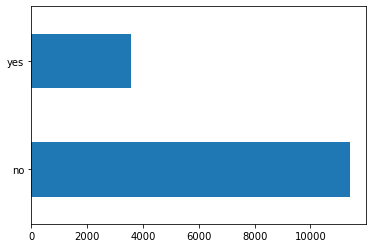
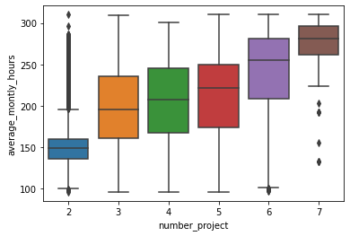

## Human Resource Analytics

Demonstration of data cleaning and problem solving using the [Human Resource Analytics data set from Kaggle](https://www.kaggle.com/cezarschroeder/human-resource-analytics-dataset/data).

### Step 1: Examine the data and plan
First, look at the data to determine a plan for cleaning and analysing it.


```python
# Load the data using Pandas
import pandas as pd
df = pd.read_csv('./datasets_146523_341407_hr_data.csv')
```


```python
# Check and make sure the data has loaded as expected
df.columns
```


    Index(['satisfaction_level', 'last_evaluation', 'number_project',
           'average_montly_hours', 'time_spend_company', 'work_accident', 'left',
           'promotion_last_5years', 'is_smoker', 'department', 'salary'],
          dtype='object')


```python
df.head()
```


<div>
<style scoped>
    .dataframe tbody tr th:only-of-type {
        vertical-align: middle;
    }

    .dataframe tbody tr th {
        vertical-align: top;
    }

    .dataframe thead th {
        text-align: right;
    }
</style>
<table border="1" class="dataframe">
  <thead>
    <tr style="text-align: right;">
      <th></th>
      <th>satisfaction_level</th>
      <th>last_evaluation</th>
      <th>number_project</th>
      <th>average_montly_hours</th>
      <th>time_spend_company</th>
      <th>work_accident</th>
      <th>left</th>
      <th>promotion_last_5years</th>
      <th>is_smoker</th>
      <th>department</th>
      <th>salary</th>
    </tr>
  </thead>
  <tbody>
    <tr>
      <th>0</th>
      <td>0.38</td>
      <td>0.53</td>
      <td>2</td>
      <td>157.0</td>
      <td>3.0</td>
      <td>0</td>
      <td>yes</td>
      <td>0</td>
      <td>NaN</td>
      <td>sales</td>
      <td>low</td>
    </tr>
    <tr>
      <th>1</th>
      <td>0.80</td>
      <td>0.86</td>
      <td>5</td>
      <td>262.0</td>
      <td>6.0</td>
      <td>0</td>
      <td>yes</td>
      <td>0</td>
      <td>yes</td>
      <td>sales</td>
      <td>medium</td>
    </tr>
    <tr>
      <th>2</th>
      <td>0.11</td>
      <td>0.88</td>
      <td>7</td>
      <td>272.0</td>
      <td>4.0</td>
      <td>0</td>
      <td>yes</td>
      <td>0</td>
      <td>NaN</td>
      <td>sales</td>
      <td>medium</td>
    </tr>
    <tr>
      <th>3</th>
      <td>0.72</td>
      <td>0.87</td>
      <td>5</td>
      <td>223.0</td>
      <td>5.0</td>
      <td>0</td>
      <td>yes</td>
      <td>0</td>
      <td>NaN</td>
      <td>sales</td>
      <td>low</td>
    </tr>
    <tr>
      <th>4</th>
      <td>0.37</td>
      <td>0.52</td>
      <td>2</td>
      <td>NaN</td>
      <td>NaN</td>
      <td>0</td>
      <td>yes</td>
      <td>0</td>
      <td>no</td>
      <td>sales</td>
      <td>low</td>
    </tr>
  </tbody>
</table>
</div>


```python
df.tail()
```


<div>
<style scoped>
    .dataframe tbody tr th:only-of-type {
        vertical-align: middle;
    }

    .dataframe tbody tr th {
        vertical-align: top;
    }

    .dataframe thead th {
        text-align: right;
    }
</style>
<table border="1" class="dataframe">
  <thead>
    <tr style="text-align: right;">
      <th></th>
      <th>satisfaction_level</th>
      <th>last_evaluation</th>
      <th>number_project</th>
      <th>average_montly_hours</th>
      <th>time_spend_company</th>
      <th>work_accident</th>
      <th>left</th>
      <th>promotion_last_5years</th>
      <th>is_smoker</th>
      <th>department</th>
      <th>salary</th>
    </tr>
  </thead>
  <tbody>
    <tr>
      <th>14994</th>
      <td>0.40</td>
      <td>0.57</td>
      <td>2</td>
      <td>151.0</td>
      <td>3.0</td>
      <td>0</td>
      <td>yes</td>
      <td>0</td>
      <td>NaN</td>
      <td>support</td>
      <td>low</td>
    </tr>
    <tr>
      <th>14995</th>
      <td>0.37</td>
      <td>0.48</td>
      <td>2</td>
      <td>160.0</td>
      <td>3.0</td>
      <td>0</td>
      <td>yes</td>
      <td>0</td>
      <td>NaN</td>
      <td>support</td>
      <td>low</td>
    </tr>
    <tr>
      <th>14996</th>
      <td>0.37</td>
      <td>0.53</td>
      <td>2</td>
      <td>143.0</td>
      <td>3.0</td>
      <td>0</td>
      <td>yes</td>
      <td>0</td>
      <td>NaN</td>
      <td>support</td>
      <td>low</td>
    </tr>
    <tr>
      <th>14997</th>
      <td>0.11</td>
      <td>0.96</td>
      <td>6</td>
      <td>280.0</td>
      <td>4.0</td>
      <td>0</td>
      <td>yes</td>
      <td>0</td>
      <td>NaN</td>
      <td>support</td>
      <td>low</td>
    </tr>
    <tr>
      <th>14998</th>
      <td>0.37</td>
      <td>0.52</td>
      <td>2</td>
      <td>158.0</td>
      <td>3.0</td>
      <td>0</td>
      <td>yes</td>
      <td>0</td>
      <td>NaN</td>
      <td>support</td>
      <td>low</td>
    </tr>
  </tbody>
</table>
</div>


```python
# Check the number of rows - make sure we got them all
with open('./datasets_146523_341407_hr_data.csv') as f:
    print(len(f.read().splitlines()))
```

    15000
    


```python
len(df) # We expect this to be 14999 as one row is the header
```


    14999


### Initial thoughts
Data is there as expected, though there are some columns with NaN values that need cleaning. Data for some features may also need to be converted into numeric data for analysis. 

### Check distribution and missing data
We've been asked to find patterns that could improve employee retention. We can therefore use the "left" column as a target. First step is to check the distribution of "left" and make sure we don't have missing data for the "left" column.


```python
# Distribution - graph it
df.left.value_counts().plot(kind='barh')

# Missing data - any nulls?
print(df.left.isnull().sum())
```

    0
    





```python
# Print the datatypes of the columns
df.dtypes
```


    satisfaction_level       float64
    last_evaluation          float64
    number_project             int64
    average_montly_hours     float64
    time_spend_company       float64
    work_accident              int64
    left                      object
    promotion_last_5years      int64
    is_smoker                 object
    department                object
    salary                    object
    dtype: object


```python
import matplotlib as plt
for feat in df.columns:
    print('Non-null Count:\t', feat, "\t", df[feat].count())

# Check proportion of NaNs
df.isnull().sum() / len(df) * 100
```

    Non-null Count:	 satisfaction_level 	 14999
    Non-null Count:	 last_evaluation 	 14999
    Non-null Count:	 number_project 	 14999
    Non-null Count:	 average_montly_hours 	 14631
    Non-null Count:	 time_spend_company 	 14848
    Non-null Count:	 work_accident 	 14999
    Non-null Count:	 left 	 14999
    Non-null Count:	 promotion_last_5years 	 14999
    Non-null Count:	 is_smoker 	 235
    Non-null Count:	 department 	 14999
    Non-null Count:	 salary 	 14999
    


    satisfaction_level        0.000000
    last_evaluation           0.000000
    number_project            0.000000
    average_montly_hours      2.453497
    time_spend_company        1.006734
    work_accident             0.000000
    left                      0.000000
    promotion_last_5years     0.000000
    is_smoker                98.433229
    department                0.000000
    salary                    0.000000
    dtype: float64


```python
# Drop the is_smoker column - we don't have enough data
del df['is_smoker']
```


```python
# For the time_spend_company, we will fill the NaN value with the median
# This is because it's an integer field so we should use a integer value
fill_value = df.time_spend_company.median()
df.time_spend_company = df.time_spend_company.fillna(fill_value)
```


```python
# Average Monthly Hours and Number Projects are related, so we can use the relationship to fill average_monthly_hours missing data

# First, make a boxplot of average_monthly_hours segmented by number_project
import seaborn as sns
sns.boxplot(x='number_project', y='average_montly_hours', data=df)
```


    <matplotlib.axes._subplots.AxesSubplot at 0x2ad3ea18fc8>





```python
# We will fill in the NaNs for average_monthly_hours with the mean for
# each group, depending on the number of projects. There is an unsurprising
# correlation between hours and projects.

# Calculate fill values
mean_per_project = df.groupby('number_project').average_montly_hours.mean()
mean_per_project = dict(mean_per_project)
print(mean_per_project)
```

    {2: 160.16353543979506, 3: 197.47882323104236, 4: 205.07858315740089, 5: 211.99962839093274, 6: 238.73947368421054, 7: 276.015873015873}
    


```python
# Map these onto the NaNs
fill_values = df.number_project.map(mean_per_project)
df.average_montly_hours = df.average_montly_hours.fillna(fill_values)
```


```python
# Make sure we have no NaNs left
assert df.isnull().sum().sum() == 0
```


```python
# Last tidying step - transform string and boolean fields into integers
# 1 for yes and 0 for no
df.left = df.left.map({'no': 0, 'yes': 1})
df = pd.get_dummies(df)
df.columns
```


    Index(['satisfaction_level', 'last_evaluation', 'number_project',
           'average_montly_hours', 'time_spend_company', 'work_accident', 'left',
           'promotion_last_5years', 'department_IT', 'department_RandD',
           'department_accounting', 'department_hr', 'department_management',
           'department_marketing', 'department_product_mng', 'department_sales',
           'department_support', 'department_technical', 'salary_high',
           'salary_low', 'salary_medium'],
          dtype='object')


```python
# Save the data to preprocessed CSV after checking it again
df.head()
```


<div>
<style scoped>
    .dataframe tbody tr th:only-of-type {
        vertical-align: middle;
    }

    .dataframe tbody tr th {
        vertical-align: top;
    }

    .dataframe thead th {
        text-align: right;
    }
</style>
<table border="1" class="dataframe">
  <thead>
    <tr style="text-align: right;">
      <th></th>
      <th>satisfaction_level</th>
      <th>last_evaluation</th>
      <th>number_project</th>
      <th>average_montly_hours</th>
      <th>time_spend_company</th>
      <th>work_accident</th>
      <th>left</th>
      <th>promotion_last_5years</th>
      <th>department_IT</th>
      <th>department_RandD</th>
      <th>...</th>
      <th>department_hr</th>
      <th>department_management</th>
      <th>department_marketing</th>
      <th>department_product_mng</th>
      <th>department_sales</th>
      <th>department_support</th>
      <th>department_technical</th>
      <th>salary_high</th>
      <th>salary_low</th>
      <th>salary_medium</th>
    </tr>
  </thead>
  <tbody>
    <tr>
      <th>0</th>
      <td>0.38</td>
      <td>0.53</td>
      <td>2</td>
      <td>157.000000</td>
      <td>3.0</td>
      <td>0</td>
      <td>1</td>
      <td>0</td>
      <td>0</td>
      <td>0</td>
      <td>...</td>
      <td>0</td>
      <td>0</td>
      <td>0</td>
      <td>0</td>
      <td>1</td>
      <td>0</td>
      <td>0</td>
      <td>0</td>
      <td>1</td>
      <td>0</td>
    </tr>
    <tr>
      <th>1</th>
      <td>0.80</td>
      <td>0.86</td>
      <td>5</td>
      <td>262.000000</td>
      <td>6.0</td>
      <td>0</td>
      <td>1</td>
      <td>0</td>
      <td>0</td>
      <td>0</td>
      <td>...</td>
      <td>0</td>
      <td>0</td>
      <td>0</td>
      <td>0</td>
      <td>1</td>
      <td>0</td>
      <td>0</td>
      <td>0</td>
      <td>0</td>
      <td>1</td>
    </tr>
    <tr>
      <th>2</th>
      <td>0.11</td>
      <td>0.88</td>
      <td>7</td>
      <td>272.000000</td>
      <td>4.0</td>
      <td>0</td>
      <td>1</td>
      <td>0</td>
      <td>0</td>
      <td>0</td>
      <td>...</td>
      <td>0</td>
      <td>0</td>
      <td>0</td>
      <td>0</td>
      <td>1</td>
      <td>0</td>
      <td>0</td>
      <td>0</td>
      <td>0</td>
      <td>1</td>
    </tr>
    <tr>
      <th>3</th>
      <td>0.72</td>
      <td>0.87</td>
      <td>5</td>
      <td>223.000000</td>
      <td>5.0</td>
      <td>0</td>
      <td>1</td>
      <td>0</td>
      <td>0</td>
      <td>0</td>
      <td>...</td>
      <td>0</td>
      <td>0</td>
      <td>0</td>
      <td>0</td>
      <td>1</td>
      <td>0</td>
      <td>0</td>
      <td>0</td>
      <td>1</td>
      <td>0</td>
    </tr>
    <tr>
      <th>4</th>
      <td>0.37</td>
      <td>0.52</td>
      <td>2</td>
      <td>160.163535</td>
      <td>3.0</td>
      <td>0</td>
      <td>1</td>
      <td>0</td>
      <td>0</td>
      <td>0</td>
      <td>...</td>
      <td>0</td>
      <td>0</td>
      <td>0</td>
      <td>0</td>
      <td>1</td>
      <td>0</td>
      <td>0</td>
      <td>0</td>
      <td>1</td>
      <td>0</td>
    </tr>
  </tbody>
</table>
<p>5 rows × 21 columns</p>
</div>


```python
df.tail()
```


<div>
<style scoped>
    .dataframe tbody tr th:only-of-type {
        vertical-align: middle;
    }

    .dataframe tbody tr th {
        vertical-align: top;
    }

    .dataframe thead th {
        text-align: right;
    }
</style>
<table border="1" class="dataframe">
  <thead>
    <tr style="text-align: right;">
      <th></th>
      <th>satisfaction_level</th>
      <th>last_evaluation</th>
      <th>number_project</th>
      <th>average_montly_hours</th>
      <th>time_spend_company</th>
      <th>work_accident</th>
      <th>left</th>
      <th>promotion_last_5years</th>
      <th>department_IT</th>
      <th>department_RandD</th>
      <th>...</th>
      <th>department_hr</th>
      <th>department_management</th>
      <th>department_marketing</th>
      <th>department_product_mng</th>
      <th>department_sales</th>
      <th>department_support</th>
      <th>department_technical</th>
      <th>salary_high</th>
      <th>salary_low</th>
      <th>salary_medium</th>
    </tr>
  </thead>
  <tbody>
    <tr>
      <th>14994</th>
      <td>0.40</td>
      <td>0.57</td>
      <td>2</td>
      <td>151.0</td>
      <td>3.0</td>
      <td>0</td>
      <td>1</td>
      <td>0</td>
      <td>0</td>
      <td>0</td>
      <td>...</td>
      <td>0</td>
      <td>0</td>
      <td>0</td>
      <td>0</td>
      <td>0</td>
      <td>1</td>
      <td>0</td>
      <td>0</td>
      <td>1</td>
      <td>0</td>
    </tr>
    <tr>
      <th>14995</th>
      <td>0.37</td>
      <td>0.48</td>
      <td>2</td>
      <td>160.0</td>
      <td>3.0</td>
      <td>0</td>
      <td>1</td>
      <td>0</td>
      <td>0</td>
      <td>0</td>
      <td>...</td>
      <td>0</td>
      <td>0</td>
      <td>0</td>
      <td>0</td>
      <td>0</td>
      <td>1</td>
      <td>0</td>
      <td>0</td>
      <td>1</td>
      <td>0</td>
    </tr>
    <tr>
      <th>14996</th>
      <td>0.37</td>
      <td>0.53</td>
      <td>2</td>
      <td>143.0</td>
      <td>3.0</td>
      <td>0</td>
      <td>1</td>
      <td>0</td>
      <td>0</td>
      <td>0</td>
      <td>...</td>
      <td>0</td>
      <td>0</td>
      <td>0</td>
      <td>0</td>
      <td>0</td>
      <td>1</td>
      <td>0</td>
      <td>0</td>
      <td>1</td>
      <td>0</td>
    </tr>
    <tr>
      <th>14997</th>
      <td>0.11</td>
      <td>0.96</td>
      <td>6</td>
      <td>280.0</td>
      <td>4.0</td>
      <td>0</td>
      <td>1</td>
      <td>0</td>
      <td>0</td>
      <td>0</td>
      <td>...</td>
      <td>0</td>
      <td>0</td>
      <td>0</td>
      <td>0</td>
      <td>0</td>
      <td>1</td>
      <td>0</td>
      <td>0</td>
      <td>1</td>
      <td>0</td>
    </tr>
    <tr>
      <th>14998</th>
      <td>0.37</td>
      <td>0.52</td>
      <td>2</td>
      <td>158.0</td>
      <td>3.0</td>
      <td>0</td>
      <td>1</td>
      <td>0</td>
      <td>0</td>
      <td>0</td>
      <td>...</td>
      <td>0</td>
      <td>0</td>
      <td>0</td>
      <td>0</td>
      <td>0</td>
      <td>1</td>
      <td>0</td>
      <td>0</td>
      <td>1</td>
      <td>0</td>
    </tr>
  </tbody>
</table>
<p>5 rows × 21 columns</p>
</div>


```python
df.to_csv('./data_hr_analytics_preprocessed.csv', index=False)
```

### Comments on the problem
This is a binary classification problem - we're trying to find a model to predict whether an employee will fit into the "left" or not category based on other data. 

**We will use three different models here: Support Vector Machines, Random Forests and K-Nearest Neighbours**

#### Support Vector Machines
SVMs try and find the best hyperplane to divide different the two classes by - they maximise the distance between the hyperplane and the closest samples of each class, the support vectors. 

This can be used to model non-linear classes using the kernel trick (mapping the features into a higher dimensional space in which the hyperplane is determined - this is also referred to as the decision surface and we will see it when training our models).

#### k-Nearest Neighbours
Classification algorithm memorises the training data and make predictions depending on the K nearest samples in the feature space. With 3 features, this can be shown as a sphere around the prediction sample. However, if we have more than 3 features, we need a hypersphere to find the closest K samples.

#### Random Forests
These are an ensemble of decision trees, where each decision tree was trained on a different subset of the training data. A decision tree algorithm classifies a sample using a series of decisions - e.g. feature X is less than or greater than 1. Each decision tree step should be determined based on the feature split that maximises information gain.

Training a random forest involves creating bootstrapped datasets for several decision trees. Predictions are then made by majority vote. The benefit is less overfitting and more generalisability.

**Other benefits of decision trees include that you can model a mix of continuous and categorical data, plus tree depth can be limited to reduce overfitting.** See [this StackOverflow thread](https://stackoverflow.com/a/1859910/3511819), which also describes concepts like node purity, information gain and entropy.


```python

```
