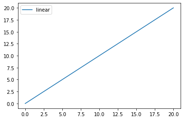
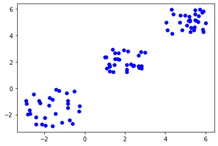
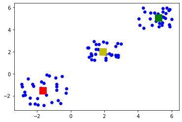

# 100 Days Of Code - Log

### Day 0: 20 June 2020

**Today's Progress**: Planned what I am going to do for the challenge - working through the content and tutorials in [i]Mastering Machine Learning for Penetration Testing[/i] by Chiheb Chebbi ([Kindle link:](https://read.amazon.com.au/kp/kshare?asin=B07CSN7QQ1&id=QHSWWvxaREGnhO8MOKuj1g&reshareId=NWJ5D150EP9SWGK4X9J2&reshareChannel=system). Also began reading the introductory parts. 

**Thoughts:** There is a lot of material and a lot of topics covered - I'm especially interested in the malware detection and automated analysis techniques.

**Link to work:** See link to Kindle book above. I searched through a bunch of resources, reviewed my notes re: automated malware analysis from the malware reverse engineering course I did in my Masters degree and read through the introductory parts of the above book. I also made sure I had CUDA, Python and everything else installed on my PC. Didn't write any actual code today, but got everything ready for me to do so.

### Day 1: 21 June 2020

**Today's Progress**: Today, I finished configuring my environment and the various packages needed, including Tensorflow, Keras, Matplotlib, Theano, Numpy, nltk, scikit-learn, pandas. I made sure they all worked and configured them.

**Thoughts:** The book was written a few years ago, so some instructions and code samples are out of date. This is especially the case with the TensorFlow documentation. However, I eventually did get everything working after some Google & Github searches and by reading the TensorFlow docs, including with GPU integration for TF.

**Link to work:** Jupyter Notebook input and output showing tests of packages:

```python
# Test Tensorflow
# NOTE: This one required searches because the book used a different version of Python and TensorFlow, so the original instructions in the book threw an exception. I needed to use TensorFlow v1 compatibility versions of the functions.
import tensorflow as tf
with tf.compat.v1.Session() as sess:
    # Build a graph
    a = tf.constant(5.0)
    b = tf.constant(6.0)
    c = a * b
    
    # Evaulate the tensor to show the result
    print(sess.run(c))
    
    # Print a constant message
    Message = tf.constant("Hello, world")
    print(sess.run(Message))
```

    30.0
    b'Hello, world'
    


```python
# Numpy version
import numpy
print (numpy.__version__)
```

    1.18.1
    


```python
# Keras version
import keras
print (keras.__version__)
```

    2.3.1
    

    Using TensorFlow backend.
    


```python
# Test pandas Series function
import pandas
data = numpy.array(['m','a','t','e',' ','m','a','l','i','c','e'])
SR = pandas.Series(data)
print(SR)
```

    0     m
    1     a
    2     t
    3     e
    4      
    5     m
    6     a
    7     l
    8     i
    9     c
    10    e
    dtype: object
    


```python
# Test matplotlib
import matplotlib.pyplot as plt
x = numpy.linspace(0, 20, 50)
plt.plot(x, x, label='linear')
plt.legend()
plt.show()
```





```python
# Test Theano
from theano import *
import theano.tensor as T
from theano import function
a = T.dscalar('a')
b = T.dscalar('b')
c = a + b
f = function([a,b],c)
print(f)
```

    <theano.compile.function_module.Function object at 0x000002AFF02A8D08>
    


```python
# Download NLTK packages
import nltk
nltk.download()
# This didn't work in a Jupyter Notebook, though when run from the command line, it did open the window prompt for downloading the NLTK packages.
```

### Day 2: 22 June 2020

**Today's Progress**: Today, I continued exploring different ML techniques, particularly k-means clustering. I followed [this tutorial on TowardsDataScience.com](https://towardsdatascience.com/understanding-k-means-clustering-in-machine-learning-6a6e67336aa1), but adapted and played with it to use three clusters instead of two.

**Thoughts:**: It is easier to learn and understand things (and do a deep dive) if you don't just take the code from a tutorial, but play around with it and make changes to figure out what the code is doing.

**Link to work:** Jupyter Notebook input and output showing what I did and how I applied the tutorial linked above to use 3 clusters instead of two:
```python
# K-means algorithm example problem
# See https://towardsdatascience.com/understanding-k-means-clustering-in-machine-learning-6a6e67336aa1

# Imports
import pandas as pd
import numpy as np
import matplotlib.pyplot as plt
from sklearn.cluster import KMeans
%matplotlib inline
```


```python
# Generate some random 2-dimensional data in 3 clusters
X = -3 * np.random.rand(90,2)
X1 = 1 + 2 * np.random.rand(30,2)
X2 = 4 + 2 * np.random.rand(30,2)
X[30:60, :] = X1
X[60:90, :] = X2
print(X)

# Plot it
plt.scatter(X[ : , 0], X[ :, 1], s = 30, c = 'b')
plt.show()
```

    [[-1.96305575 -2.2428845 ]
     [-2.19739499 -1.11404593]
     [-2.75020776 -1.65310121]
     [-2.69427492 -1.93723546]
     [-2.87150032 -1.18331403]
     [-1.59501325 -0.86336695]
     [-0.5027995  -0.21509638]
     [-1.44657685 -1.91938354]
     [-0.28510956 -1.76132023]
     [-2.27671956 -0.93838003]
     [-1.76038424 -1.32796534]
     [-0.74989114 -2.41879182]
     [-0.88550699 -0.3793209 ]
     [-0.82655644 -1.17922566]
     [-1.13422539 -2.59545101]
     [-0.6040179  -2.68422497]
     [-1.432666   -0.09867595]
     [-2.83759307 -1.95672627]
     [-1.58347931 -2.86239005]
     [-0.84069795 -1.46263935]
     [-0.84394999 -0.96535328]
     [-1.74997511 -0.72377881]
     [-0.2504464  -1.37094578]
     [-2.11336712 -2.71166619]
     [-2.90674859 -0.96297269]
     [-2.5287912  -0.44090839]
     [-2.41671627 -2.72009239]
     [-2.41299429 -2.19741712]
     [-1.95244635 -2.80681175]
     [-1.28141203 -0.20437735]
     [ 2.81571865  1.69901656]
     [ 1.47466129  1.76500408]
     [ 1.4089057   1.22839287]
     [ 1.22734351  1.2594175 ]
     [ 2.0995269   1.25544633]
     [ 1.06780966  2.36650428]
     [ 1.24954012  1.62791495]
     [ 2.40779198  1.65827322]
     [ 1.19870674  1.80108215]
     [ 2.83289534  1.51720081]
     [ 1.08730237  1.48727431]
     [ 2.78255296  2.75141881]
     [ 2.69590571  1.55604799]
     [ 1.25456642  1.68768563]
     [ 1.70581848  2.1801736 ]
     [ 1.39578218  2.9234598 ]
     [ 1.02085297  2.35742519]
     [ 1.51369045  2.65639516]
     [ 2.68302279  2.50228107]
     [ 1.68031062  2.644794  ]
     [ 2.42871946  1.72746234]
     [ 1.61401031  2.20611659]
     [ 2.67636913  1.67687357]
     [ 2.28734124  1.83265011]
     [ 2.09137305  1.75392469]
     [ 2.09442907  1.4127667 ]
     [ 2.14468986  2.80807686]
     [ 1.50359989  2.23364041]
     [ 1.94028328  2.86459681]
     [ 2.98538377  2.71745169]
     [ 5.18657202  5.43204392]
     [ 5.16390954  5.11839316]
     [ 5.62223869  5.02222303]
     [ 5.65702085  5.45287869]
     [ 4.3372138   4.11944562]
     [ 4.9720088   5.50251916]
     [ 5.72267779  5.93617433]
     [ 4.32086517  5.94690435]
     [ 5.41036417  4.41341569]
     [ 4.11753873  4.41906103]
     [ 4.73697101  4.98820212]
     [ 5.49123308  5.59745903]
     [ 4.76290747  5.51879271]
     [ 5.45322721  4.64188389]
     [ 5.90418598  5.8301828 ]
     [ 4.03563972  4.96880339]
     [ 5.99576742  4.94379181]
     [ 5.20903351  5.07698911]
     [ 5.48974347  5.16510757]
     [ 5.25598997  4.26580794]
     [ 5.21041325  5.17196454]
     [ 5.8432588   5.71601492]
     [ 5.47263053  5.90079761]
     [ 5.07010964  4.77198347]
     [ 5.53177225  5.12822877]
     [ 4.41475081  5.59397927]
     [ 5.85391822  4.44057416]
     [ 4.83305904  4.41958972]
     [ 5.28976388  4.58762924]
     [ 5.88544563  4.24557471]]
    





```python
# Get the K-means parameters - assign an arbitrary value of 3 to K (we have 3 clusters)
Kmean = KMeans(n_clusters=3)
Kmean.fit(X)
```


    KMeans(algorithm='auto', copy_x=True, init='k-means++', max_iter=300,
           n_clusters=3, n_init=10, n_jobs=None, precompute_distances='auto',
           random_state=None, tol=0.0001, verbose=0)


```python
# Find the centre of the clusters
centersArrays = Kmean.cluster_centers_
print(centersArrays)

# Display the centroids on top of the blue points using green, red and yellow colours
plt.scatter(X[ : , 0], X[ : , 1], s = 30, c = 'b')
plt.scatter(centersArrays[0][0], centersArrays[0][1], s = 200, c = 'g', marker = 's')
plt.scatter(centersArrays[1][0], centersArrays[1][1], s = 200, c = 'r', marker = 's')
plt.scatter(centersArrays[2][0], centersArrays[2][1], s = 200, c = 'y', marker = 's')
plt.show()
```

    [[ 5.20834102  5.07788053]
     [-1.65648394 -1.52992878]
     [ 1.9122968   2.00529227]]
    





```python
# Test the algorithm - show the labels. 
# The result should be a series of 0-2 indicating which cluster each item belongs to
Kmean.labels_
```


    array([1, 1, 1, 1, 1, 1, 1, 1, 1, 1, 1, 1, 1, 1, 1, 1, 1, 1, 1, 1, 1, 1,
           1, 1, 1, 1, 1, 1, 1, 1, 2, 2, 2, 2, 2, 2, 2, 2, 2, 2, 2, 2, 2, 2,
           2, 2, 2, 2, 2, 2, 2, 2, 2, 2, 2, 2, 2, 2, 2, 2, 0, 0, 0, 0, 0, 0,
           0, 0, 0, 0, 0, 0, 0, 0, 0, 0, 0, 0, 0, 0, 0, 0, 0, 0, 0, 0, 0, 0,
           0, 0])


```python
# Try and predict the cluster of a random data point
sample_test = np.random.randint(low = -3, high = 6, size = 2)
second_test = sample_test.reshape(1, -1)
print(second_test)
Kmean.predict(second_test)
```

    [[ 1 -3]]
    


    array([1])


```python

```
### Day 3: 24 June 2020

**Today's Progress**: I skipped a day due to being too busy with work, but continued this evening with an analysis of the Boston Housing Dataset using Pandas and scikit-learn - namely, linear and polynomial regression. I also used matplotlib and Seaborn to show various graphs, both to visualise the data and visualise confidence intervals and errors. 

**Thoughts:**: Although numeric representations of mean squared error values and the like can be helpful, having a visual graph helps reveal things that a set of numbers might not easily show. For example, the Boston Housing Dataset's median house price value had a capped top bin at $50k, which created some obvious patterns. Also, the benefits of using polynomial regression rather than linear regression for this problem were far more obvious when the lines and scatter plots were graphed, as the graphs showed that the polynomial line matched more nicely. The MSE was lower too, but displaying things visually helps.

**Link to work:** Due to this file getting too long, I am going to start posting the Jupyter Notebook output separately starting with this one. See [boston-housing-dataset-analysis.md](https://github.com/MateMalice/100-days-of-code/blob/master/boston-housing-dataset-analysis.md) in this repo.
