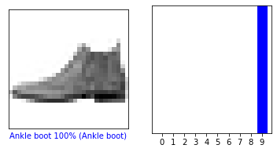
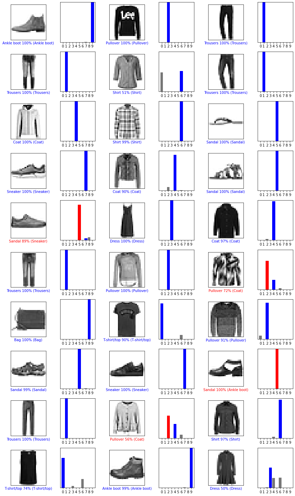

```python
# Tensorflow image classification test

# Imports
import tensorflow as tf
from tensorflow import keras
import numpy as np
import matplotlib.pyplot as plt

# Print version
print(tf.__version__)
```

    2.1.0
    


```python
# Load the fashion mnist dataset
fashion_mnist = keras.datasets.fashion_mnist
(train_images, train_labels), (test_images, test_labels) = fashion_mnist.load_data()
```


```python
# Define the class names
class_names = ['T-shirt/top','Trousers','Pullover','Dress','Coat','Sandal','Shirt','Sneaker','Bag','Ankle boot']
```


```python
# Explore data shape, labels, etc. to make sure training and test data are comparable
print('Training images shape: ', train_images.shape)
print('Number of training labels: ', len(train_labels))
print('Training label examples: ', train_labels)
print('Test images shape: ', test_images.shape)
print('Number of test labels: ', len(test_labels))
print('Test label examples: ', test_labels)
```

    Training images shape:  (60000, 28, 28)
    Number of training labels:  60000
    Training label examples:  [9 0 0 ... 3 0 5]
    Test images shape:  (10000, 28, 28)
    Number of test labels:  10000
    Test label examples:  [9 2 1 ... 8 1 5]
    


```python
# Preprocess the data - first, show the pixel values
plt.figure()
plt.imshow(train_images[0])
plt.colorbar()
plt.grid(False)
plt.show()
```


```python
# Scale all values to a range of 0-1 by dividing by 255.
train_images = train_images / 255.0
test_images = test_images / 255.0
```


```python
# Verify that data is in the correct format by showing the first 25 images with labels
plt.figure(figsize=(10,10))
for i in range(25):
    plt.subplot(5, 5, i+1)
    plt.xticks([])
    plt.yticks([])
    plt.grid(False)
    plt.imshow(train_images[i], cmap=plt.cm.binary)
    plt.xlabel(class_names[train_labels[i]])
plt.show()
```


```python
# Set up the model layers - use relu activation
model = keras.Sequential([
    keras.layers.Flatten(input_shape=(28, 28)),
    keras.layers.Dense(128, activation='relu'),
    keras.layers.Dense(10)
])
```


```python
# Compile the model - use the Adam optimiser and sparse categorical cross-entropy as the loss function
model.compile(optimizer='adam', loss=tf.keras.losses.SparseCategoricalCrossentropy(from_logits=True), metrics=['accuracy'])
```


```python
# Train the model - start fitting to the training data
model.fit(train_images, train_labels, epochs=20)
```

    Train on 60000 samples
    Epoch 1/20
    60000/60000 [==============================] - 2s 39us/sample - loss: 0.4996 - accuracy: 0.8251
    Epoch 2/20
    60000/60000 [==============================] - 2s 33us/sample - loss: 0.3754 - accuracy: 0.8646
    Epoch 3/20
    60000/60000 [==============================] - 2s 33us/sample - loss: 0.3363 - accuracy: 0.8764
    Epoch 4/20
    60000/60000 [==============================] - 2s 33us/sample - loss: 0.3111 - accuracy: 0.8874
    Epoch 5/20
    60000/60000 [==============================] - 2s 32us/sample - loss: 0.2922 - accuracy: 0.8919
    Epoch 6/20
    60000/60000 [==============================] - 2s 32us/sample - loss: 0.2808 - accuracy: 0.8963
    Epoch 7/20
    60000/60000 [==============================] - 2s 32us/sample - loss: 0.2682 - accuracy: 0.9003
    Epoch 8/20
    60000/60000 [==============================] - 2s 32us/sample - loss: 0.2568 - accuracy: 0.9043
    Epoch 9/20
    60000/60000 [==============================] - 2s 32us/sample - loss: 0.2474 - accuracy: 0.9069
    Epoch 10/20
    60000/60000 [==============================] - 2s 32us/sample - loss: 0.2378 - accuracy: 0.9117
    Epoch 11/20
    60000/60000 [==============================] - 2s 31us/sample - loss: 0.2302 - accuracy: 0.9133
    Epoch 12/20
    60000/60000 [==============================] - 2s 32us/sample - loss: 0.2212 - accuracy: 0.9177
    Epoch 13/20
    60000/60000 [==============================] - 2s 31us/sample - loss: 0.2156 - accuracy: 0.9191
    Epoch 14/20
    60000/60000 [==============================] - 2s 31us/sample - loss: 0.2104 - accuracy: 0.9216
    Epoch 15/20
    60000/60000 [==============================] - 2s 31us/sample - loss: 0.2037 - accuracy: 0.9238
    Epoch 16/20
    60000/60000 [==============================] - 2s 31us/sample - loss: 0.1972 - accuracy: 0.9265
    Epoch 17/20
    60000/60000 [==============================] - 2s 32us/sample - loss: 0.1919 - accuracy: 0.9279
    Epoch 18/20
    60000/60000 [==============================] - 2s 32us/sample - loss: 0.1863 - accuracy: 0.9299
    Epoch 19/20
    60000/60000 [==============================] - 2s 32us/sample - loss: 0.1829 - accuracy: 0.9310
    Epoch 20/20
    60000/60000 [==============================] - 2s 32us/sample - loss: 0.1773 - accuracy: 0.9331
    


    <tensorflow.python.keras.callbacks.History at 0x1c032460e88>


```python
# Evaluate accuracy
test_loss, test_acc = model.evaluate(test_images, test_labels, verbose=2)
print('\nTest accuracy:', test_acc)
```

    10000/10000 - 0s - loss: 0.3448 - accuracy: 0.8906
    
    Test accuracy: 0.8906
    


```python
# Make predictions
probability_model = tf.keras.Sequential([model, tf.keras.layers.Softmax()])
predictions = probability_model.predict(test_images)
print('Predicted class for first test item: ', np.argmax(predictions[0]))
print('Label for first test item: ', test_labels[0])
```

    Predicted class for first test item:  9
    Label for first test item:  9
    


```python
# Define functions for plotting predictions
def plot_image(i, predictions_array, true_label, img):
    predictions_array, true_label, img = predictions_array, true_label[i], img[i]
    plt.grid(False)
    plt.xticks([])
    plt.yticks([])

    plt.imshow(img, cmap=plt.cm.binary)

    predicted_label = np.argmax(predictions_array)
    if predicted_label == true_label:
        color = 'blue'
    else:
        color = 'red'

    plt.xlabel("{} {:2.0f}% ({})".format(class_names[predicted_label],
                                100*np.max(predictions_array),
                                class_names[true_label]),
                                color=color)

def plot_value_array(i, predictions_array, true_label):
    predictions_array, true_label = predictions_array, true_label[i]
    plt.grid(False)
    plt.xticks(range(10))
    plt.yticks([])
    thisplot = plt.bar(range(10), predictions_array, color="#777777")
    plt.ylim([0, 1])
    predicted_label = np.argmax(predictions_array)

    thisplot[predicted_label].set_color('red')
    thisplot[true_label].set_color('blue')
```


```python
# Verify a few predictions
i = 0
plt.figure(figsize=(6,3))
plt.subplot(1,2,1)
plot_image(i, predictions[i], test_labels, test_images)
plt.subplot(1,2,2)
plot_value_array(i, predictions[i], test_labels)
plt.show()

i = 11
plt.figure(figsize=(6,3))
plt.subplot(1,2,1)
plot_image(i, predictions[i], test_labels, test_images)
plt.subplot(1,2,2)
plot_value_array(i, predictions[i], test_labels)
plt.show()
```





```python
# Plot the first 30 images
num_rows = 10
num_cols = 3
num_images = num_rows * num_cols
plt.figure(figsize=(2*2*num_cols, 2*num_rows))
for i in range(num_images):
    plt.subplot(num_rows, 2*num_cols, 2*i+1)
    plot_image(i, predictions[i], test_labels, test_images)
    plt.subplot(num_rows, 2*num_cols, 2*i+2)
    plot_value_array(i, predictions[i], test_labels)
plt.tight_layout()
plt.show()
```





```python

```
